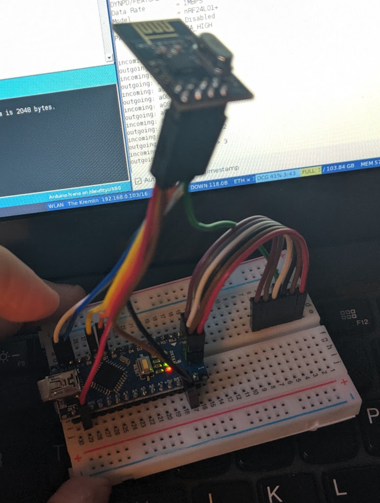
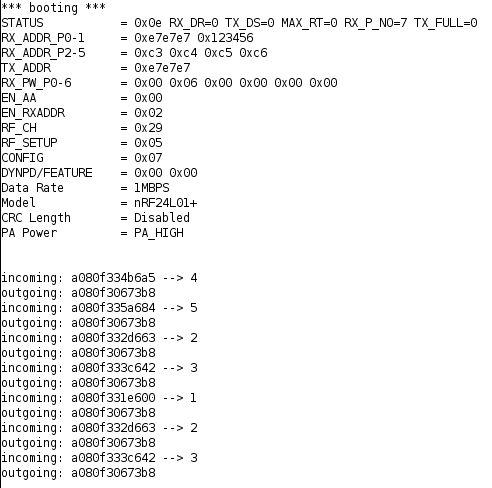
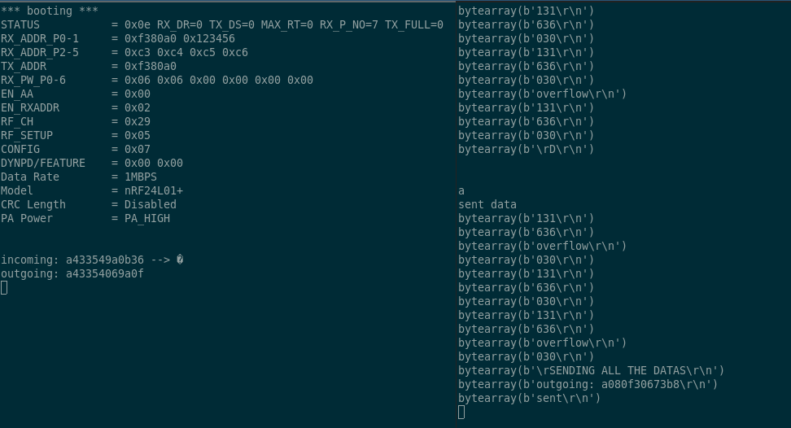

At Royal Holloway, for the 2018 intake of first year undergraduates it was decided that due to the class size, paper registers were infeasible. The clicker systems was proposed and developed. This uses a Turning Technologies "Response Card" (Figure 1) typically used to respond to interactive questionnaires as part of a slideshow. The device communicates with a base station connected to a computer via USB (Universal Serial Bus) when a key option is pressed (eg. "1/A") and transmits the unique ID of the device and the key press. The message is acknowledged by the base station and the user is given visual affirmation on the device that their response was counted. The results are then stored in a semi-proprietary format attached to the slideshow which is decoded, processed and analysed by the department using a collection of scripts, Excel spreadsheets and custom software. 


Whilst researching the device I discovered the work of @goodspeed_travis_2010 who reverse engineered a similar, but older device. He dumped the firmware of the device allowing him to analyse the way the device operated and how packets were structured and sent. A number of important discoveries were made. 
Firstly, @goodspeed_travis_2010  writes "The Clicker is built upon a Nordic nRF24E1 chip, which combines an 8051 microcontroller with an nRF2401 radio transceiver.". The nRF2401 is a 2.4GHz, serial radio transceiver.[@nordic_semiconductor_asa_single_2004] The datasheet lists a number of potential applications including telemetry, keyless entry and home security and automation. The chip also uses what the datasheet describes as a "3-wire serial interface." - this is otherwise know as SPI (Serial Peripheral Interface) and allows easy interface with devices such as a Raspberry Pi and Arduino. 
Secondly, there is no encryption. As @goodspeed_travis_2010 writes "...it is clear that the first three bytes will be the target MAC address. From the RADIOWRCONFIG() function, it is equally clear that the three bytes at 0x1B are the receiving MAC address of the unit.". This means that the source, destination and the parameter (the button pressed) are transmitted in cleartext with the only validation being a CRC (Cyclic Redundancy Check). The message is not signed, so there is no way to verify that a message has indeed come from the advertised source. 

## Cyclic Redundancy Check 

CRC's are a method of error checking that are widely used in serial communications[@borrelli_ieee_2001]. Parity bits, which indicate whether the expected value is even or odd, have been commonly used to detect communication errors however, these suffer from two major flaws. Firstly, it is not possible for you to determine where the corruption has ocurred in a piece of data - it is (usually) not possible to repair the message and it has to be discarded and resent. Secondly, if two corruptions occur then the data may end up passing the parity check but still be invalid. Additional measures (such as length checking, strict processing validation etc.) can be included to reduce the risks of bad data being processed, but these remain significant flaws. 

CRCs works using modulo arithmetic on some generated polynomials. The general formula to calculate a CRC is: 

$CRC = remainder of \left[ M(x) \times \frac{ x^n }{ G(x) } \right]$

Where `M(x)` is the sum of the message used as the coefficients in a polynomial. For example, with a message `1010`: 

$M(x) = (1 \times x^3) + (0 \times x^2) + (1 \times x^1) + (0 \times x^0)$

And `G(x)` is known as the "generating polynomial" and is generally defined by the type of CRC you are using. For CRC-16 (which is the type used for the nRF24E1) `G(x)` is defined as: 

$G(x) = (1 \times x^16) + (0 \times x^15) + (1 \times x^2) + 1$

In this particular situation, it is possible to calculate the CRC on the nRF24E1 in the ShockBurst\texttrademark configuration settings by setting the `CRC_EN` flag bit. This means the chip will calculate and append the CRC as well as strip and validate the CRC on messages received.[@nordic_semiconductor_asa_single_2004] In the @mooney_nickmooney/turning-clicker_2019 implementation, CRC is calculated on the Arduino not on the nRF24E1 due to technical issues getting this working. The CRC is instead calculated and checked using an alternative library.[@frank_frankboesing/fastcrc_2019]

## Hardware

It is possible to use any Arduino and nRF24E1 breakout board for this project - I elected to use the Arduino Nano and the cheapest nRF24E1 board I could find on eBay. The Arduino is placed on a breadboard and the nRF24E1 connected via Dupont leads to the requisite pins. 



As always, this can be a somewhat complex operation and it did require consultation of not only the nRF24E1's advertised pin layout[@noauthor_1/2/3/5/10_nodate] but also a setup guide for a similar, but not identical product from Sparkfun [@noauthor_nrf24l01+_nodate].

The pinout I used is listed in Table {@tbl:table1}

| Name | nRF24E1 | Arduino |
|------|---------|---------|
| VCC  | 2       | 3.3v    |
| GND  | 1       | GND     |
| IRQ  | 8       | GND     |
| CE   | 3       | D7      |
| CSN  | 4       | D8      |
| MOSI | 6       | D11     |
| MISO | 7       | D12     |
| SCK  | 5       | D13     |

Table: The chosen pinout. {#tbl:table1}

With the addition of a mini USB cable to connect the Arduino to your computer, the hardware setup is complete. It is important to note that the hardware required for the base station emulator is identical to that required for the clicker emulator. 

## Installation

The setup of the software environment on the computer is relatively simple and is based around the Arduino IDE which is available from: https://www.arduino.cc/en/main/software. It appears there is now an online version, but this has not been tested with this project. 

Once the Arduino IDE is installed you should try flashing the Arduino with the example "blink" code, available from File $\rightarrow$ Examples $\rightarrow$ Basic. 

Assuming you have installed the IDE correctly and have specified the serial port and Arduino type, you should be rewarded with a blinking status LED. 

You can also compile and upload code from within other IDEs using plugins. VSCode has various plugins for this, setup of which is beyond the scope of this document. However, since it took me a while to discover this - it is important that you set up a VSCode Workspace so the Arduino Sketch file (containing running preferences such as the serial port, baud rate etc.) can be created and saved. Otherwise, you cannot upload any code. 

To run the project code, two libraries are required - RF24 (a library to handle communication with the nRF24E1) and FastCRC (to calculate the CRC checksums). 
For the former, Sparkfun have published a guide on installation the RF24 library into the correct folder in your filesystem: https://learn.sparkfun.com/tutorials/nrf24l01-transceiver-hookup-guide/arduino-code
The FastCRC library is installed in a similar fashion.

You should then be able to verify and upload the project code! If you get library errors, ensure the libraries have been imported correctly and the IDE shows them in the GUI. 

It is also important to note that the baud rate used in the project is 115200 - without that set correctly it will not be possible to communicate with the Arduino via the IDE's serial console. 

The Python scripts to manage serial communication with the Arduinos are designed to be run in Python3. No libraries not available via Pip are used, but what is installed by default varies per system so it is advised to try running the code and install any missing libraries as required. 

### Frequent Issues

`avrdude: stk500_getsync() attempt 1 of 10: not in sync: resp=0x00` 

This error occurs when either:

- The Arduino is disconnected or cannot be connected to: check the USB
- The wrong Arduino type is selected: check the board configuration and the type of CPU used 

`Cannot upload: device/resource busy`

This occurs when the serial connection to the serial port is already in use. Ensure you don't have any serial consoles open, or any of the Python scripts running. 
If that doesn't work, you may be specifying the wrong serial port. 

## Clicker Basestation

The script to emulate the basestation of the clicker system is made up of two parts, the Arduino code and Python script. The former is essentially an unmodified version of the @mooney_nickmooney/turning-clicker_2019 file, which was developed a number of years ago. The interesting point here is that his work was developed on an entirely different device, and shows how widely this system has been deployed and the range of different devices available all using the same protocol. 
The Arduino code listens for a transmission on the configured channel and then checks the CRC (discussed above). It then prints out the received packet to the serial console and returns the "accepted" message to the clicker. This doesn't really do anything except cause the clicker to flash a green LED instead of a red one (as it does without proper acknowledgement to a message). 
The Python script is substantially modified from the original @mooney_nickmooney/turning-clicker_2019 code and provides a basic serial program to interact with the basestation emulator. It connects to the serial port and parses the aforementioned outputs, before saving them to a specified output file in a CSV format. Because of the way the serial printing is formatted, regex is required - the expression is the work of @mooney_nickmooney/turning-clicker_2019. 

An example output from the Python script:
```
address_from,address_to,button
a080f3,31e600,1
a080f3,35a684,5
a080f3,396708,9
a080f3,396708,9
a080f3,387729,8
a08167,35459b,5
a08167,35459b,5
a08167,35459b,5
a08167,35459b,5
a08167,35459b,5
a08167,35459b,5
a08167,35459b,5
a08167,35459b,5
```

As you can see, the from address (the clicker address), the to address (the hardcoded basestation address) and the button pressed are included. This is a significant improvement on the output from the current solution, I am led to believe. 

The output on the serial console is shown in Figure 3. 



## Clicker emulator 

The hardware for the emulation of a clicker is exactly the same as that required for a basestation - the difference is purely in the code and associated processing of data. My high level plan was: 

- Modify Arduino script to send to the hardcoded basestation address
- Modify Arduino script to take input of "sent from" addresses over serial 
- Write a Python utility script to feed the Arduino with clicker addresses to emulate 

I first decided to tackle getting addresses into the Arduino over a serial connection - it seems deceptively simple! I intially planned to use the `String` components of the Arduino `Serial` library - `Serial.readStringUntil`[@noauthor_arduino_nodate], for example. This had the advantage of avoiding having to worry about lower level buffer constructs and also allowed abstraction from having to handle reading from the Serial buffer until a certain point (end of string etc.). Sadly, this did not work for a few reasons. The addresses being sent are actually binary values, usually represented in hexadecimal, and the String library cannot deal with this raw data. The "until" also proved to be somewhat unreliable and would not terminate necessarily on a line feed. This may well have been the product of other issues, however. 

If you cannot use the String abstraction, you have to handle raw `Chars` - these are individual bytes that you place into a buffer of suitable length. Arduinos use Harvard rather than Von Neumann CPU architectures so the data and system memory (RAM) are on different buses - this makes a buffer overflow exploit difficult, but not impossible. You do therefore need to be careful when handling buffers to ensure you do not deliberately overflow a buffer. 

The basic code (encapsulated in a loop) is as follows:

```
if(Serial.available() > 0 && counter != BUFSIZE){
    char incoming = Serial.read();

    if (incoming == '\r') {
        
    } else {
        incomingData[counter] = incoming;
        counter++;
    }
}
```

When the Serial port is available and the counter has not reached the buffer size
    - Read a single character from the Serial port 
    - If it is a `\r` (line feed) then handle that case
    - Otherwise, place it in the buffer and increment the counter 

This is all well and good but you need to get an address over the Serial connection in the first place! Sadly, you cannot just send `OxA0` - by doing so you are sending the literal ASCII codes for each individual char (eg. `A` = 65) you need to send the "hex values" for each byte, which is then a single char. One way to get a hex ASCII value is via `echo -ne "OxA0` which will print out the char you want. Sadly, when I sent this to the Arduino (using Screen) I ended up filling the buffer several times over with values that were completely unrelated. I still do not understand the cause of this issue - I suspect it may have been triggering some Screen escape codes. 

I then moved to using a Python script which was more easily rerun. In order to both read and send data over the Serial connection I had two threads - one to receive data using code from StackOverflow (which works excellently) and another to send characters as required:

```
conn.write(str.encode("160"))
conn.write(str.encode("160"))
conn.write(str.encode("160"))
conn.write(str.encode("\r"))
```
 
This more predictably populated the buffer at the other end, as shown in Figure 4. In the clicker basestation you can see one packet received - this is from other (presumably IoT) devices that use the same channel and addressing structure. You can also see the attempt to send data on the right with the various interesting echos back with different values to that which are sent, from the Arduino. The one outgoing packet shown to be sent was actually hardcoded and exposed another bug. 



It turns out that although the outgoing packet is correctly formatted (when compared to incoming packets from a clicker as received by the emulator basestation) no packet is actually sent, or at least received at the other end. This is a fairly critical error and I think may stem from my misunderstanding over how the code works (which address is which). I have not yet resolved this and I may not - I am quickly going down a rabbit hole of ASCII encoding already. 

## Conclusion 

I have successfully implemented (using code from @mooney_nickmooney/turning-clicker_2019) a clicker basestation and associated Python script which I believe actually has a practical use, to replace the current PowerPoint slide system. 
The emulation of the clickers themselves has proved more tricky and the adaptation of the code has been difficult - I am looking at how to resolve this but I think it will require rewriting a substantial portion of the original code. The encoding issue over serial is a problem, but not a huge disaster at the moment. I am unlikely to expend significant effort on this now, until I can guarantee I can actually send packets between the two Arduinos. 

# Acknowledgements 

Thanks to @tom_pollard_template_2016 for the front cover template which I have adapted, @marco_torchiano_how_2015 for the Pandoc table preamble and @cohen_third_2013 for the Final Year Project guide and suggested layouts. 

\pagebreak 
\onecolumn 

# Bibiography 

<!--
Due to the nature of this project, available references on the subject are limited and will be confined to more general information security concepts as well as attendance monitoring. In this report the available references are provided by those who have investigated these devices beforehand. 
-->

<div id="refs"></div>