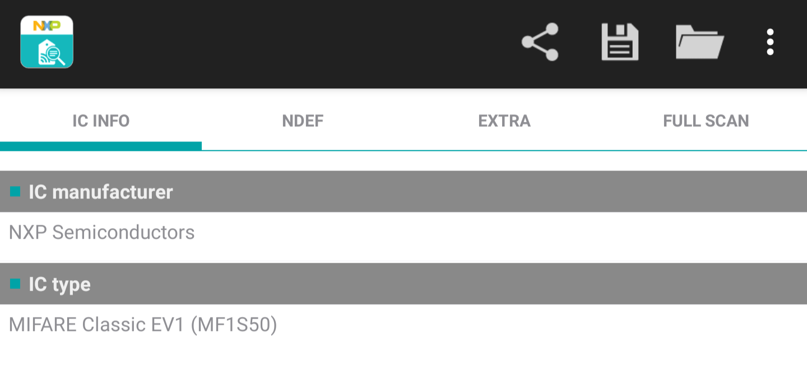

# Abstract

At Royal Holloway, for the 2018 intake of first year undergraduates it was decided that due to the class size, paper registers were infeasible. The clicker system was proposed and developed which has been discussed in previous reports; particularly with regard to the system security. The key advantage of the clicker system was that it did not rely on the signature of students (it used a wireless electronic device) and therefore did not require the laborious administration overheard of transposing the signatures into an electronic database. Fundamentally, it was not more secure and this element of an improved system will be discussed in a future report. 

One of the key advantages that the clicker system had over the registers was that it utilise wireless communication such that students could 'click in' on a short range handheld device, rather than pass around a physical register sheet. The range of the clickers is advertised as being around a 200ft radius [@noauthor_c21_nodate] which in the context of a lecture theatre, is actually quite large! Based on practical experience (and not wishing to go down a rabbit hole to find out definitively), I postulate that for most lecture theatres that would include the entire room plus a short distance outside - taking into account the attenuation of the signal through the walls. 

Considering the range of other wireless communication technologies: 
- Radio Frequency Identification (RFID): a maximum of 20ft [@nikitin_performance_2006] with a passive tag. 
- Near Field Communication (NFC): a few centimeters [@fischer_nfc_2009] 
- Bluetooth: "short range" [@heydon_bluetooth_2013]

# Student ID Cards



At the beginning of the 2019 Winter Term, the College began issuing new student ID cards and reissuing older cards. The new cards were found to contain a MIFARE Classic chip (Figure 1). The MIFARE chip was originally released in 1994 by what became NXP [@mayes_mifare_2010] as a product primarily for mass transit cards, but also later for door key cards and the like. The MIFARE design was very proprietary with only the (48 bit) key length disclosed to the security community. For example, the chip used an undisclosed encryption algorithm developed by Phillips (who became NXP) that had not been researched or investigated by the wider security community. As is well accepted in Kerckhoff's Principle, we should always assume the attacker has the maximum knowledge of the system including details of the encryption algorithms used, nonce generation algorithms and other design features. The only item assumed not to be known by default is any private keys generated. This principle ensures that any tendency to default to "security by obscurity" is avoided as, as in the case of MIFARE, if your security model relies on design details being disclosed it is very vulnerable to espionage, reverse engineering or simply errors in parties disclosing too many details. 

In December 2007 at the Chaos Computer Conference [@Pnohl_mifare_nodate] [@nohl_reverse-engineering_nodate], a presentation was given where researchers presented analysis where it was demonstrated it was possible to generate the nonces used in the chip (as the randomness is determined by the number of clock cycles since the chip is initialized) and by analyzing 27 of mutual authentication captures repetition of the challenge response was observed. It was also shown by trial by error in bit flipping the unique identifier transmitted by the card was linked to the keys used and such there exists for each session key as a result of the mutual authentication, for a given key and unique identifier. This allows recovery of the key used based on the unique identifier presented by the chip and the challenge response sent.  

This has been developed further and it has been possible to generate key rainbow tables (as they only have a 48 bit length) and use these tables to carry out brute force searches on encrypted sectors for arbitrary cards. Note in the dump in Appendix 1 sector 6 is unreadable - this is the secured sector for which a key is needed for the reader to access the sector. Using software implementing the later nested attack on MIFARE [@noauthor_nfc-tools/mfcuk_2019] and an Android application to interrogate the card [@klostermeier_ikarus23/mifareclassictool_2019] it was possible to recover this sector: 

```
30313836343536342020202020202020
00000000000000000000000000000000
00000000000000000000000000000000
------------7877880045FA49A0C327
``` 

Where, `45FA49A0C327` is the key, `7877880045` the Access Control bits and `30313836343536342020202020202020` the stored data. Converted from hexadecimal to ASCII it reads `01864564`, which is my student ID number (as printed on the front of the card). With the key it is possible to rewrite any student ID card (or any MIFARE Classic card for that matter) with any ID number, or arbitrary data. Through a separate vulnerability, it is possible to retrieve any card ID number from the College LDAP extended attributes. So, you can write any of these new cards (used for access control, payments etc.) with any ID number and it offers no security above the magnetic stripe technology in use on the older cards.  

I therefore propose not to use the student ID cards for authentication, as they are demonstrably insecure with little knowledge of the MIFARE technology or cryptography. 

# Bluetooth Low Energy 

_Section with reference to @gomez_overview_2012, @heydon_bluetooth_2013, @townsend_getting_2014 and @bluetooth_sig_specification_2010. Given the former books are drawn from the specification and crossover is large between all three sources, exact citation is not provided._

In the 4th Edition of the Bluetooth Specification [@bluetooth_sig_specification_2010], issued by the Bluetooth Special Interest Group the Bluetooth Low Energy devices were introduced. These devices were to in addition to what is known as Bluetooth Classic - the most well known version of Bluetooth used in all manner of consumer accessories from headphones to keyboards, and now adopted in scientific and industrial applications. Three classes of devices were available: Bluetooth Classic (only), Bluetooth Low Energy and Bluetooth Smart Ready; the latter supporting both Classic and Low Energy protocols. The intention behind Low Energy was to go almost in the opposite direction to Classic - a very low bandwidth device which would not remain constantly connected designed around applications that issued sporadic commands to retrieve data or initiate control sequences. In comparison to Bluetooth Classic at the time, Bluetooth Low Energy has a theoretical bandwidth of 1MB/s vs 54 MB/s with Classic [@heydon_bluetooth_2013] [@gomez_overview_2012]. Low Energy operates on the 2.4GHz frequency band with a channel spacing of 2MHz (40 channels) with 3 channels dedicated for advertisement broadcasts - channels 37, 38 and 39 [@townsend_getting_2014]. In order to minimize interference with other Bluetooth devices and other standards on the same frequency (WiFi, Bluetooth Classic, ZigBee) frequency hopping is used where the channel is changed upon each interaction based on the following formula [@townsend_getting_2014]: 

```
channel = (curr_channel + hop) mod 37
``` 

The `hop` is predetermined at the initial authentication with the Bluetooth device and remains constant throughout the life of the connection. 

Gaussian Frequency Shift Keying (GFSK) is used as the modulation for transmitted signals. This is fairly common for devices operating on the 2.4GHz band and was filed for patent in 1998 @hsiang-te_ho_us6480553.pdf_nodate. When radio signals are transmitted they are modulated (mixed) with a carrier signal at the frequency of transmission. GSFK uses a filter based on the Gaussian function. The exact reasons for doing this are beyond the scope of this report, but they relate to reducing the effects of interference during transmission. 

The Bluetooth 4.0 specification defined two actors: a master and a slave. During the asymmetric connection process, the slave advertises itself on the advertising channels with a 31 byte packet. It is possible to send an additional 31 byte packet with additional data upon interrogation by a Master (sending a Scan Request packet) - this is Active Scanning and Passive Scanning is merely monitoring the data sent on the advertising channels. 

\begin{figure}

  \centering
  \begin{sequencediagram}

    \newinst[1]{A}{Master}{}
    \newinst[2]{B}{Slave}{}
    \mess{call}{B}{Advertising Data}{A}{}
    \end{call}

    \postlevel
    
    \begin{call}{A}{Scan Request}{B}{Scan Response}
    \end{call}

  \end{sequencediagram}
\end{figure}

# Acknowledgements 

Thanks to @tom_pollard_template_2016 for the front cover template which I have adapted, @marco_torchiano_how_2015 for the Pandoc table preamble and @cohen_third_2013 for the Final Year Project guide and suggested layouts. 

\pagebreak 
\onecolumn 

# Bibiography 

<!--
Due to the nature of this project, available references on the subject are limited and will be confined to more general information security concepts as well as attendance monitoring. In this report the available references are provided by those who have investigated these devices beforehand. 
-->

<div id="refs"></div>

\pagebreak

# Appendix 

## Appendix 1: student ID full tag output 

```
** TagInfo scan (version 4.24.5) 2019-11-27 17:44:39 **
Report Type: External

-- IC INFO ------------------------------

# IC manufacturer:
NXP Semiconductors

# IC type:
MIFARE Classic EV1 (MF1S50)

-- NDEF ------------------------------

# No NDEF data storage present:
Maximum NDEF storage size after format: 716 bytes

-- EXTRA ------------------------------

# Memory size:
1 kB
* 16 sectors, with 4 blocks per sector
* 64 blocks, with 16 bytes per block

# IC detailed information:
Full product name: MF1S507xX/V1

# Originality check:
Signature verified with NXP public key

-- FULL SCAN ------------------------------

# Technologies supported:
MIFARE Classic compatible
ISO/IEC 14443-3 (Type A) compatible
ISO/IEC 14443-2 (Type A) compatible

# Android technology information:
Tag description:
* TAG: Tech [android.nfc.tech.NfcA, android.nfc.tech.MifareClassic, android.nfc.tech.NdefFormatable]
* Maximum transceive length: 253 bytes
* Default maximum transceive time-out: 618 ms

# Detailed protocol information:
ID: E2:F8:0C:77
ATQA: 0x0400
SAK: 0x08

# Memory content:
Sector 0 (0x00)
[00] r--  E2 F8 0C 77 61 88 04 00 C8 23 00 20 00 00 00 18 |...wa....#. ....|
[01] rwi  00 00 00 00 00 00 00 00 00 00 00 00 00 00 00 00 |................|
[02] rwi  00 00 00 00 00 00 00 00 00 00 00 00 00 00 00 00 |................|
[03] wxx  FF:FF:FF:FF:FF:FF FF:07:80 69 FF:FF:FF:FF:FF:FF
          Factory default key           Factory default key (readable)

Sector 1 (0x01)
[04] rwi  00 00 00 00 00 00 00 00 00 00 00 00 00 00 00 00 |................|
[05] rwi  00 00 00 00 00 00 00 00 00 00 00 00 00 00 00 00 |................|
[06] rwi  00 00 00 00 00 00 00 00 00 00 00 00 00 00 00 00 |................|
[07] wxx  FF:FF:FF:FF:FF:FF FF:07:80 69 FF:FF:FF:FF:FF:FF
          Factory default key           Factory default key (readable)

Sector 2 (0x02)
[08] rwi  00 00 00 00 00 00 00 00 00 00 00 00 00 00 00 00 |................|
[09] rwi  00 00 00 00 00 00 00 00 00 00 00 00 00 00 00 00 |................|
[0A] rwi  00 00 00 00 00 00 00 00 00 00 00 00 00 00 00 00 |................|
[0B] wxx  FF:FF:FF:FF:FF:FF FF:07:80 69 FF:FF:FF:FF:FF:FF
          Factory default key           Factory default key (readable)

Sector 3 (0x03)
[0C] rwi  00 00 00 00 00 00 00 00 00 00 00 00 00 00 00 00 |................|
[0D] rwi  00 00 00 00 00 00 00 00 00 00 00 00 00 00 00 00 |................|
[0E] rwi  00 00 00 00 00 00 00 00 00 00 00 00 00 00 00 00 |................|
[0F] wxx  FF:FF:FF:FF:FF:FF FF:07:80 69 FF:FF:FF:FF:FF:FF
          Factory default key           Factory default key (readable)

Sector 4 (0x04)
[10] rwi  00 00 00 00 00 00 00 00 00 00 00 00 00 00 00 00 |................|
[11] rwi  00 00 00 00 00 00 00 00 00 00 00 00 00 00 00 00 |................|
[12] rwi  00 00 00 00 00 00 00 00 00 00 00 00 00 00 00 00 |................|
[13] wxx  FF:FF:FF:FF:FF:FF FF:07:80 69 FF:FF:FF:FF:FF:FF
          Factory default key           Factory default key (readable)

Sector 5 (0x05)
[14] rwi  00 00 00 00 00 00 00 00 00 00 00 00 00 00 00 00 |................|
[15] rwi  00 00 00 00 00 00 00 00 00 00 00 00 00 00 00 00 |................|
[16] rwi  00 00 00 00 00 00 00 00 00 00 00 00 00 00 00 00 |................|
[17] wxx  FF:FF:FF:FF:FF:FF FF:07:80 69 FF:FF:FF:FF:FF:FF
          Factory default key           Factory default key (readable)

Sector 6 (0x06)
[18] ???  -- -- -- -- -- -- -- -- -- -- -- -- -- -- -- --
[19] ???  -- -- -- -- -- -- -- -- -- -- -- -- -- -- -- --
[1A] ???  -- -- -- -- -- -- -- -- -- -- -- -- -- -- -- --
[1B] ???  XX:XX:XX:XX:XX:XX --:--:-- -- XX:XX:XX:XX:XX:XX
          (unknown key)                 (unknown key)

Sector 7 (0x07)
[1C] rwi  00 00 00 00 00 00 00 00 00 00 00 00 00 00 00 00 |................|
[1D] rwi  00 00 00 00 00 00 00 00 00 00 00 00 00 00 00 00 |................|
[1E] rwi  00 00 00 00 00 00 00 00 00 00 00 00 00 00 00 00 |................|
[1F] wxx  FF:FF:FF:FF:FF:FF FF:07:80 69 FF:FF:FF:FF:FF:FF
          Factory default key           Factory default key (readable)

Sector 8 (0x08)
[20] rwi  00 00 00 00 00 00 00 00 00 00 00 00 00 00 00 00 |................|
[21] rwi  00 00 00 00 00 00 00 00 00 00 00 00 00 00 00 00 |................|
[22] rwi  00 00 00 00 00 00 00 00 00 00 00 00 00 00 00 00 |................|
[23] wxx  FF:FF:FF:FF:FF:FF FF:07:80 69 FF:FF:FF:FF:FF:FF
          Factory default key           Factory default key (readable)

Sector 9 (0x09)
[24] rwi  00 00 00 00 00 00 00 00 00 00 00 00 00 00 00 00 |................|
[25] rwi  00 00 00 00 00 00 00 00 00 00 00 00 00 00 00 00 |................|
[26] rwi  00 00 00 00 00 00 00 00 00 00 00 00 00 00 00 00 |................|
[27] wxx  FF:FF:FF:FF:FF:FF FF:07:80 69 FF:FF:FF:FF:FF:FF
          Factory default key           Factory default key (readable)

Sector 10 (0x0A)
[28] rwi  00 00 00 00 00 00 00 00 00 00 00 00 00 00 00 00 |................|
[29] rwi  00 00 00 00 00 00 00 00 00 00 00 00 00 00 00 00 |................|
[2A] rwi  00 00 00 00 00 00 00 00 00 00 00 00 00 00 00 00 |................|
[2B] wxx  FF:FF:FF:FF:FF:FF FF:07:80 69 FF:FF:FF:FF:FF:FF
          Factory default key           Factory default key (readable)

Sector 11 (0x0B)
[2C] rwi  00 00 00 00 00 00 00 00 00 00 00 00 00 00 00 00 |................|
[2D] rwi  00 00 00 00 00 00 00 00 00 00 00 00 00 00 00 00 |................|
[2E] rwi  00 00 00 00 00 00 00 00 00 00 00 00 00 00 00 00 |................|
[2F] wxx  FF:FF:FF:FF:FF:FF FF:07:80 69 FF:FF:FF:FF:FF:FF
          Factory default key           Factory default key (readable)

Sector 12 (0x0C)
[30] rwi  00 00 00 00 00 00 00 00 00 00 00 00 00 00 00 00 |................|
[31] rwi  00 00 00 00 00 00 00 00 00 00 00 00 00 00 00 00 |................|
[32] rwi  00 00 00 00 00 00 00 00 00 00 00 00 00 00 00 00 |................|
[33] wxx  FF:FF:FF:FF:FF:FF FF:07:80 69 FF:FF:FF:FF:FF:FF
          Factory default key           Factory default key (readable)

Sector 13 (0x0D)
[34] rwi  00 00 00 00 00 00 00 00 00 00 00 00 00 00 00 00 |................|
[35] rwi  00 00 00 00 00 00 00 00 00 00 00 00 00 00 00 00 |................|
[36] rwi  00 00 00 00 00 00 00 00 00 00 00 00 00 00 00 00 |................|
[37] wxx  FF:FF:FF:FF:FF:FF FF:07:80 69 FF:FF:FF:FF:FF:FF
          Factory default key           Factory default key (readable)

Sector 14 (0x0E)
[38] rwi  00 00 00 00 00 00 00 00 00 00 00 00 00 00 00 00 |................|
[39] rwi  00 00 00 00 00 00 00 00 00 00 00 00 00 00 00 00 |................|
[3A] rwi  00 00 00 00 00 00 00 00 00 00 00 00 00 00 00 00 |................|
[3B] wxx  FF:FF:FF:FF:FF:FF FF:07:80 69 FF:FF:FF:FF:FF:FF
          Factory default key           Factory default key (readable)

Sector 15 (0x0F)
[3C] rwi  00 00 00 00 00 00 00 00 00 00 00 00 00 00 00 00 |................|
[3D] rwi  00 00 00 00 00 00 00 00 00 00 00 00 00 00 00 00 |................|
[3E] rwi  00 00 00 00 00 00 00 00 00 00 00 00 00 00 00 00 |................|
[3F] wxx  FF:FF:FF:FF:FF:FF FF:07:80 69 FF:FF:FF:FF:FF:FF
          Factory default key           Factory default key (readable)

r/R=read, w/W=write, i/I=increment,
d=decr/transfer/restore, x=r+w, X=R+W
data block: r/w/i/d:key A|B, R/W/I:key B only,
  I/i implies d, *=value block
trailer (order: key A, AC, key B): r/w:key A,
  W:key B, R:key A|B, (r)=readable key
AC: W implies R+r, R implies r

--------------------------------------
```