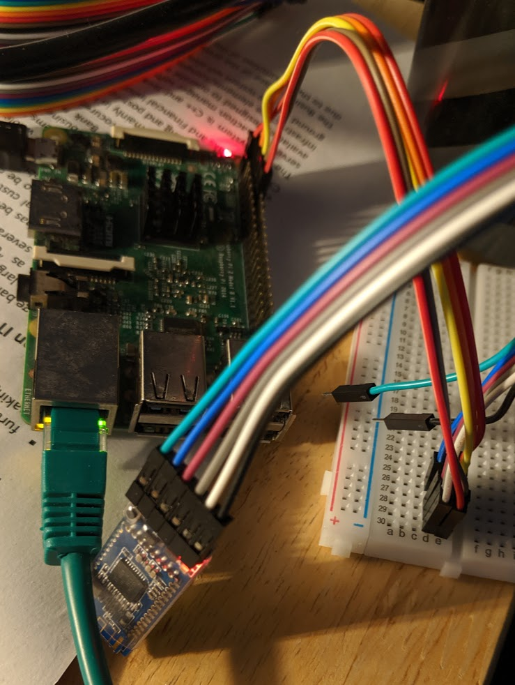

# Abstract

At Royal Holloway, for the 2018 intake of first year undergraduates it was decided that due to the class size, paper registers were infeasible. The clicker system was proposed and developed which has been discussed in previous reports; particularly with regard to the system security. The key advantage of the clicker system was that it did not rely on the signature of students (it used a wireless electronic device) and therefore did not require the laborious administration overheard of transposing the signatures into an electronic database. Fundamentally, it was not more secure and this element of an improved system will be discussed in a future report. 

One of the key advantages that the clicker system had over the registers was that it utilise wireless communication such that students could 'click in' on a short range handheld device, rather than pass around a physical register sheet. The range of the clickers is advertised as being around a 200ft radius [@noauthor_c21_nodate] which in the context of a lecture theatre, is actually quite large! Based on practical experience (and not wishing to go down a rabbit hole to find out definitively), I postulate that for most lecture theatres that would include the entire room plus a short distance outside - taking into account the attenuation of the signal through the walls. 

Considering the range of other wireless communication technologies: 

- Radio Frequency Identification (RFID): a maximum of 20ft [@nikitin_performance_2006] with a passive tag. 
- Near Field Communication (NFC): a few centimeters [@fischer_nfc_2009] 
- Bluetooth: "short range" [@heydon_bluetooth_2013]

# Student ID Cards


At the beginning of the 2019 Winter Term, the College began issuing new student ID cards and reissuing older cards. The new cards were found to contain a MIFARE Classic chip (Figure 1). The MIFARE chip was originally released in 1994 by what became NXP [@mayes_mifare_2010] as a product primarily for mass transit cards, but also later for door key cards and the like. The MIFARE design was very proprietary with only the (48 bit) key length disclosed to the security community. For example, the chip used an undisclosed encryption algorithm developed by Phillips (who became NXP) that had not been researched or investigated by the wider security community. As is well accepted in Kerckhoff's Principle, we should always assume the attacker has the maximum knowledge of the system including details of the encryption algorithms used, nonce generation algorithms and other design features. The only item assumed not to be known by default is any private keys generated. This principle ensures that any tendency to default to "security by obscurity" is avoided as, as in the case of MIFARE, if your security model relies on design details being disclosed it is very vulnerable to espionage, reverse engineering or simply errors in parties disclosing too many details. 

In December 2007 at the Chaos Computer Conference [@nohl_mifare_nodate] [@nohl_reverse-engineering_nodate], a presentation was given where researchers presented analysis where it was demonstrated it was possible to generate the nonces used in the chip (as the randomness is determined by the number of clock cycles since the chip is initialized) and by analyzing 27 of mutual authentication captures repetition of the challenge response was observed. It was also shown by trial by error in bit flipping the unique identifier transmitted by the card was linked to the keys used and such there exists for each session key as a result of the mutual authentication, for a given key and unique identifier. This allows recovery of the key used based on the unique identifier presented by the chip and the challenge response sent.  

This has been developed further and it has been possible to generate key rainbow tables (as they only have a 48 bit length) and use these tables to carry out brute force searches on encrypted sectors for arbitrary cards. Note in the dump in Appendix 1 sector 6 is unreadable - this is the secured sector for which a key is needed for the reader to access the sector. Using software implementing the later nested attack on MIFARE [@noauthor_nfc-tools/mfcuk_2019] and an Android application to interrogate the card [@klostermeier_ikarus23/mifareclassictool_2019] it was possible to recover this sector: 

```
30313836343536342020202020202020
00000000000000000000000000000000
00000000000000000000000000000000
------------7877880045FA49A0C327
``` 

Where, `45FA49A0C327` is the key, `7877880045` the Access Control bits and the hexadecimal beginning `303138...` the stored data. Converted from hexadecimal to ASCII it reads `01864564`, which is my student ID number (as printed on the front of the card). With the key it is possible to rewrite any student ID card (or any MIFARE Classic card for that matter) with any ID number, or arbitrary data. Through a separate vulnerability, it is possible to retrieve any card ID number from the College LDAP extended attributes. So, it is possible to write any of these cards (used for access control, payments etc.) with any ID number and they offers no security above the magnetic stripe technology in use on the older cards.  

I therefore propose not to use the student ID cards for authentication, as they are demonstrably insecure with little knowledge of the MIFARE technology or cryptography. 

# Bluetooth Low Energy 

_Section with reference to @gomez_overview_2012, @heydon_bluetooth_2013, @townsend_getting_2014 and @bluetooth_sig_specification_2010. Given the former books are drawn from the specification and crossover is large between all three sources, exact citation is not provided._

In the 4th Edition of the Bluetooth Specification [@bluetooth_sig_specification_2010], issued by the Bluetooth Special Interest Group the Bluetooth Low Energy devices were introduced. These devices were to in addition to what is known as Bluetooth Classic - the most well known version of Bluetooth used in all manner of consumer accessories from headphones to keyboards, and now adopted in scientific and industrial applications. Three classes of devices were available: Bluetooth Classic (only), Bluetooth Low Energy and Bluetooth Smart Ready; the latter supporting both Classic and Low Energy protocols. The intention behind Low Energy was to go almost in the opposite direction to Classic - a very low bandwidth device which would not remain constantly connected designed around applications that issued sporadic commands to retrieve data or initiate control sequences. In comparison to Bluetooth Classic at the time, Bluetooth Low Energy has a theoretical bandwidth of 1MB/s vs 54 MB/s with Classic [@heydon_bluetooth_2013] [@gomez_overview_2012]. Low Energy operates on the 2.4GHz frequency band with a channel spacing of 2MHz (40 channels) with 3 channels dedicated for advertisement broadcasts - channels 37, 38 and 39 [@townsend_getting_2014]. In order to minimize interference with other Bluetooth devices and other standards on the same frequency (WiFi, Bluetooth Classic, ZigBee) frequency hopping is used where the channel is changed upon each interaction based on the following formula [@townsend_getting_2014]: 

```
channel = (curr_channel + hop) mod 37
```

The `hop` is predetermined at the initial authentication with the Bluetooth device and remains constant throughout the life of the connection. 

Gaussian Frequency Shift Keying (GFSK) is used as the modulation for transmitted signals. This is fairly common for devices operating on the 2.4GHz band and was filed for patent in 1998 @hsiang-te_ho_us6480553.pdf_nodate. When radio signals are transmitted they are modulated (mixed) with a carrier signal at the frequency of transmission. GSFK uses a filter based on the Gaussian function. The exact reasons for doing this are beyond the scope of this report, but they relate to reducing the effects of interference during transmission. 

The Bluetooth 4.0 specification defined two actors: a master and a slave. During the asymmetric connection process, the slave advertises itself on the advertising channels with a 31 byte packet. It is possible to send an additional 31 byte packet with additional data upon interrogation by a Master (sending a Scan Request packet) - this is Active Scanning and Passive Scanning is merely monitoring the data sent on the advertising channels. 

```{=tex}
\begin{figure}
    \centering
    \begin{sequencediagram}

    \newinst[1]{A}{Master}{}
    \newinst[2]{B}{Slave}{}
    \mess{B}{Advertising Data}{A}{}

    \postlevel

    \begin{call}{A}{Scan Request}{B}{Scan Response}
    \end{call}

    \end{sequencediagram}
\end{figure}
```

In Bluetooth 4.0 the slave may be connected to one master device with master devices permitted to connect to a number of slave devices. This was updated in version 4.1 of the specification [@bluetooth_sig_specification_2013] to allow slaves to have multiple connections to a master at any one time, although slave to slave communication remains unsupported. Low Energy uses Time Division Multiplexing to achieve long periods with the radio off (to conserve power) transmitting and receiving packets only at pre-determined intervals. This can give a battery life measured in years, but does mean the bandwidth is limited, as previously discussed. 

The Bluetooth stack uses L2CAP (Logical Link Control and Adaptation Protocol) at second lowest level of the stack (the Physical Layer handling the modulation and transmission of packets is below) and this is responsible for the assembling of packets and managing the Physical layer to ensure downstream units, such as the HCI, are not overwhelmed. 

Bluetooth defines a number of modules including the Generic Attribute Profile and the Generic Access Profile, which help abstract services away from the hardware and provide common interfaces between devices. The exact mechanisms of these and the general design is beyond the scope of this report - we simply accept that the Bluetooth specification provides these services for our convenience. 

However, the security mechanisms provided are of interest especially given the weaknesses noted in MIFARE. 

## Security Manager

One module is the Security Manager which handles the mutual generation of keys for encrypted communications and interfaces with the L2CAP module and is only present in Low Energy devices (in Classic device it is integrated in the Controller). Using hardware modules it is able to provide various cryptographic functions for the key exchanges. 

The security function used is an AES-128-bit block cipher. The Advanced Encryption Standard [@national_fips_2001] was chosen as a result of a RFP issued by the United States National Institute of Standards and Technology looking to replace the then aging and provably broken Data Encryption Standard (DES), developed many years before. The algorithm chosen was Rijndael [@daemen_rijndael_1999] and operated on 128, 196 and 256 bit blocks and is a symmetric cipher. AES works by applying a round function to the data input using the expanded key as a state. On each round a byte substitution, then row movement and finally column function is applied to the data. Each round the designed part of the key is XOR'd with the state. There are 10, 12 or 14 rounds dependant on key length and the last round does not mix the columns. Applying the algorithm in reverse is possible and allows decryption of the ciphertext.

When Bluetooth devices are paired an STK (Short Term Key) is generated to encrypt data symetricall with AES in transit. Pairing is carried out via three methods: 

- Just Works: values to generate STKs are exchanged with no encryption over the link offering no man-in-the-middle protection. Interception of the values allows an attacker to generate their own copy of the STK and decrypt and potentially spoof further communications. 
- Passkey: a 6 digit numeric code is assigned to the Slave device and on pairing the Master requires user input of this code which is then used to generate a key to encrypt exchanged values for the STK generation. 
- Out of band: values are exchanged outside of the Bluetooth protocol to allow encryption of the values to generate the short term key. 

It should be noted that in the proposed implementation, Just Works pairing will be used. It is possible to use Passkey pairing however since each student would know the identical code it would offer no protection against them intercepting their own packets and thus has negligible security benefits as they are the main adversaries. There are technical limitations to dynamically changing the Passkey on Bluetooth Low Energy Slaves and this is currently not properly supported. 

# BLE Device Investigations

Investigations into practical applications and small projects with Bluetooth Low Energy yielded several articles mentioning the HM-10. [@loginov_how_2019] The HM-10 is based on a Texas Instruments BLE System On Chip mounted as a daughter board to breakout a serial UART connection. At this time only BLE devices are officially supported via the Web Bluetooth APIs. [@webbluetoothcg_web_2019]


As this device provides a serial interface, an additional microprocessor will be required to interface with the device and to receive, process and then respond to data sent to the device. A Raspbery Pi was chosen over an Arduino due to the increased processing power, onboard networking and full operating system. This also allows for higher level languages like Python to be used instead of C++, speeding up development. As no analogue inputs are required there is no real advantage to using an Arduino here. A Rasperry Pi Zero was configured to run in headless mode with a terminal over USB [@gbaman_simple_nodate] however it transpired that whilst the Raspberry Pi does have two UARTs available, one is used for the onboard Bluetooth and the UART used for the Linux console is shared with the UART exposed on the GPIO. [@noauthor_raspberry_nodate] It was therefore necessary to change approach and a Raspberry Pi 2B was provisioned with SSH enabled (add an empty file: `/boot/ssh`) was configured such that direct a ethernet connection to the laptop was possible, with ethernet passthrough to the laptop's wireless connection. 

The HM-10 was then attached with Dupont leads to the GPIO of the Raspberry Pi using pinouts for the Pi and the markings on the HM-10 breakout board. [@noauthor_pi4j_nodate]



Initially, the device was detected on the serial port and a connection could be established. However, there was no data sent by the device and no acknowledgement of data sent down the serial port. The HM-10 uses AT commands which are commonly found in GSM modules and the like - the HM-10 likely uses these given the industry crossover. The manual for the HM-10 [@jnhuamao_technology_company_hm-10-datasheet.pdf_2014] lists a few basic AT commands which can be used to interrogate basic data such as the device status: 

- `AT` should return the device status: `OK` or `OK/LOST`
- `AT+ADDR?` should return the device MAC: `OK+ADDR:{MAC address}`

The datasheet also describes that a string over 80 characters should be sent to take the device out of standby. The string data is not relevant, just the length. 

The manual states the serial parameters are:

- 9600 Baud 
- No parity 
- 1 stop bit 
- 8 bit byte length 

A few attempts were made using these settings and different serial decoders (Minicom, Screen) - no response was received. Appendix 2 contains an output from Minicom for one attempt (including configuration). 

It transpired that AT commands are actually a time based command set. They do not rely on a carriage return or line feed to indicate the end of a command, but they do timeout - within 100ms usually. [@milosevich_at_2006] A timeout on a valid command will cause the command to be executed and the result returned - an invalid command may generate no response at all. 

Looking at the Raspberry Pi forums identified a small number of questions relating to this, including a thread where a user had reported some working test code. [@noauthor_how_nodate] The code is actually very trivial - it opens a serial connection with the correct parameters and then sends data before listening. Because AT commands use a 100ms timeout it is not necessary to run two threads to send and receive data - after sending a command it is simply necessary to wait for any data on the serial buffer for 100ms before continuing. I modified the script to: 

- Send the long string (above 80 characters)
- Send the `AT` command and listen for a response 
- Send the `AT+ADDR?` command and listen for a response 

The script is provided in Appendix 3. 

Running this script several times with different RX/TX pin configurations and baud rates did not yield any results and the only success was some null bytes, as in Figure 4. 


Reading around the UART protocol, it transpired that flow control is sometimes required for devices. [@mark_duncombe_is_nodate] Flow control is used to indicate to the other party when it is 'safe' to send data and when it is not. As UART is so ubiquitous it is likely there will be cases where the buffer size and the processing capabilities between devices is vastly different. To prevent more capable devices flooding low powered devices (either leading to lost data or exceptions) the crosscoupled `state` (RTS) and `enable` (CTS) supplement the data lines and when a device needs to inhibit further data it will bring the `state` line to Logic 0 (`enable` on the partner device). [@silicon_labs_an0059.0:_2017]

The Raspberry Pi does support hardware flow control, however enabling it is non-trivial and it was not possible to enable it in Minicom, after looking into several methods of enabling it. [@vince_deater_raspberry_nodate]

Upon speaking with Dave Cohen and investigating further it was suggested that as the RX pin of the HM-10 was technically 3.3V, providing a 5V signal could cause issues. A potential divider was tried but this also failed to resolve the issues. [@martyn_currey_hm-10_2017] It also appeared that later versions of firmware used the higher 15200 baud rate - this was also tested. 

It was also observed that using a BLE Scanner Android application (Figure 5), it was possible to connect to the HM-10 and read out the GATT data - no acknowledgement of the connection was observed on the serial port as expected and documented. This suggested the device was, in part, functioning as expected. 


Up until this point, two HM-10 devices from the same source had been used. Due to the issues encountered another was procured from an alternative supplier. Upon swapping it like for like with the other HM-10, it worked first time with the script provided in Appendix 3. This does validate that this was a hardware issue rather than "user error" however the exact issue is unknown. 


Using a BLE Terminal app it was then possible to send data via the HM-10 to a running screen session as in Figures 8 and 9:


Focus is then on integrating this with the Web Bluetooth APIs to transmit data from a browser down to the Bluetooth device. 

The support for the Web Bluetooth APIs is rather more limited than I had believed and only Chromium and Opera offer any support for the APIs. [@mozilla_web_nodate] The officially updated development progress can be found [here](https://github.com/WebBluetoothCG/web-bluetooth/blob/master/implementation-status.md).

Based on a development guide from Google (written by a member of the Web Bluetooth Community Group) [@francois_beaufort_interact_2015] a very basic solution was developed (Appendix 4) and there are several items to note. 

The Web Bluetooth API requires user interaction on the page before scanning can even take place, and in any event the user needs to explicitly provide consent to pair with a device via a prompt. In the solution, an `onClick` event from a button is used to call the function. Once called the function scans devices and looks for an explicit unique identifier for the specific HM-10 in use (transcribed from the BLE Scanner app): `0x484D536F6674`. It is possible to apply filters based on GATT characteristics however for simplicity this is avoided. The name of the device should then be logged, and the pairing sequence initiated (requiring user confirmation). 

Web Bluetooth is so experimental that it requires enabling a Chromium feature flag [@noauthor_web_nodate] and on Linux, enabling an experimental flag for Bluez [@acassis_how_2016]. 

At the moment issues with Chromium detecting available Bluetooth cards via Bluez persist (Figure 10) and it has not been able to properly test the solution. Trials with other operating systems may be necassry to have a working Proof of Concept. 


# Acknowledgements 

Thanks to @tom_pollard_template_2016 for the front cover template which I have adapted, @marco_torchiano_how_2015 for the Pandoc table preamble and @cohen_third_2013 for the Final Year Project guide and suggested layouts. 

\pagebreak 
\onecolumn 

# Bibiography 

<!--
Due to the nature of this project, available references on the subject are limited and will be confined to more general information security concepts as well as attendance monitoring. In this report the available references are provided by those who have investigated these devices beforehand. 
-->

<div id="refs"></div>

\pagebreak

# Appendix 

## Appendix 1: student ID full tag output 

```
** TagInfo scan (version 4.24.5) 2019-11-27 17:44:39 **
Report Type: External

-- IC INFO ------------------------------

# IC manufacturer:
NXP Semiconductors

# IC type:
MIFARE Classic EV1 (MF1S50)

-- NDEF ------------------------------

# No NDEF data storage present:
Maximum NDEF storage size after format: 716 bytes

-- EXTRA ------------------------------

# Memory size:
1 kB
* 16 sectors, with 4 blocks per sector
* 64 blocks, with 16 bytes per block

# IC detailed information:
Full product name: MF1S507xX/V1

# Originality check:
Signature verified with NXP public key

-- FULL SCAN ------------------------------

# Technologies supported:
MIFARE Classic compatible
ISO/IEC 14443-3 (Type A) compatible
ISO/IEC 14443-2 (Type A) compatible

# Android technology information:
Tag description:
* TAG: Tech [android.nfc.tech.NfcA, android.nfc.tech.MifareClassic, android.nfc.tech.NdefFormatable]
* Maximum transceive length: 253 bytes
* Default maximum transceive time-out: 618 ms

# Detailed protocol information:
ID: E2:F8:0C:77
ATQA: 0x0400
SAK: 0x08

# Memory content:
Sector 0 (0x00)
[00] r--  E2 F8 0C 77 61 88 04 00 C8 23 00 20 00 00 00 18 |...wa....#. ....|
[01] rwi  00 00 00 00 00 00 00 00 00 00 00 00 00 00 00 00 |................|
[02] rwi  00 00 00 00 00 00 00 00 00 00 00 00 00 00 00 00 |................|
[03] wxx  FF:FF:FF:FF:FF:FF FF:07:80 69 FF:FF:FF:FF:FF:FF
          Factory default key           Factory default key (readable)

Sector 1 (0x01)
[04] rwi  00 00 00 00 00 00 00 00 00 00 00 00 00 00 00 00 |................|
[05] rwi  00 00 00 00 00 00 00 00 00 00 00 00 00 00 00 00 |................|
[06] rwi  00 00 00 00 00 00 00 00 00 00 00 00 00 00 00 00 |................|
[07] wxx  FF:FF:FF:FF:FF:FF FF:07:80 69 FF:FF:FF:FF:FF:FF
          Factory default key           Factory default key (readable)

Sector 2 (0x02)
[08] rwi  00 00 00 00 00 00 00 00 00 00 00 00 00 00 00 00 |................|
[09] rwi  00 00 00 00 00 00 00 00 00 00 00 00 00 00 00 00 |................|
[0A] rwi  00 00 00 00 00 00 00 00 00 00 00 00 00 00 00 00 |................|
[0B] wxx  FF:FF:FF:FF:FF:FF FF:07:80 69 FF:FF:FF:FF:FF:FF
          Factory default key           Factory default key (readable)

Sector 3 (0x03)
[0C] rwi  00 00 00 00 00 00 00 00 00 00 00 00 00 00 00 00 |................|
[0D] rwi  00 00 00 00 00 00 00 00 00 00 00 00 00 00 00 00 |................|
[0E] rwi  00 00 00 00 00 00 00 00 00 00 00 00 00 00 00 00 |................|
[0F] wxx  FF:FF:FF:FF:FF:FF FF:07:80 69 FF:FF:FF:FF:FF:FF
          Factory default key           Factory default key (readable)

Sector 4 (0x04)
[10] rwi  00 00 00 00 00 00 00 00 00 00 00 00 00 00 00 00 |................|
[11] rwi  00 00 00 00 00 00 00 00 00 00 00 00 00 00 00 00 |................|
[12] rwi  00 00 00 00 00 00 00 00 00 00 00 00 00 00 00 00 |................|
[13] wxx  FF:FF:FF:FF:FF:FF FF:07:80 69 FF:FF:FF:FF:FF:FF
          Factory default key           Factory default key (readable)

Sector 5 (0x05)
[14] rwi  00 00 00 00 00 00 00 00 00 00 00 00 00 00 00 00 |................|
[15] rwi  00 00 00 00 00 00 00 00 00 00 00 00 00 00 00 00 |................|
[16] rwi  00 00 00 00 00 00 00 00 00 00 00 00 00 00 00 00 |................|
[17] wxx  FF:FF:FF:FF:FF:FF FF:07:80 69 FF:FF:FF:FF:FF:FF
          Factory default key           Factory default key (readable)

Sector 6 (0x06)
[18] ???  -- -- -- -- -- -- -- -- -- -- -- -- -- -- -- --
[19] ???  -- -- -- -- -- -- -- -- -- -- -- -- -- -- -- --
[1A] ???  -- -- -- -- -- -- -- -- -- -- -- -- -- -- -- --
[1B] ???  XX:XX:XX:XX:XX:XX --:--:-- -- XX:XX:XX:XX:XX:XX
          (unknown key)                 (unknown key)

Sector 7 (0x07)
[1C] rwi  00 00 00 00 00 00 00 00 00 00 00 00 00 00 00 00 |................|
[1D] rwi  00 00 00 00 00 00 00 00 00 00 00 00 00 00 00 00 |................|
[1E] rwi  00 00 00 00 00 00 00 00 00 00 00 00 00 00 00 00 |................|
[1F] wxx  FF:FF:FF:FF:FF:FF FF:07:80 69 FF:FF:FF:FF:FF:FF
          Factory default key           Factory default key (readable)

Sector 8 (0x08)
[20] rwi  00 00 00 00 00 00 00 00 00 00 00 00 00 00 00 00 |................|
[21] rwi  00 00 00 00 00 00 00 00 00 00 00 00 00 00 00 00 |................|
[22] rwi  00 00 00 00 00 00 00 00 00 00 00 00 00 00 00 00 |................|
[23] wxx  FF:FF:FF:FF:FF:FF FF:07:80 69 FF:FF:FF:FF:FF:FF
          Factory default key           Factory default key (readable)

Sector 9 (0x09)
[24] rwi  00 00 00 00 00 00 00 00 00 00 00 00 00 00 00 00 |................|
[25] rwi  00 00 00 00 00 00 00 00 00 00 00 00 00 00 00 00 |................|
[26] rwi  00 00 00 00 00 00 00 00 00 00 00 00 00 00 00 00 |................|
[27] wxx  FF:FF:FF:FF:FF:FF FF:07:80 69 FF:FF:FF:FF:FF:FF
          Factory default key           Factory default key (readable)

Sector 10 (0x0A)
[28] rwi  00 00 00 00 00 00 00 00 00 00 00 00 00 00 00 00 |................|
[29] rwi  00 00 00 00 00 00 00 00 00 00 00 00 00 00 00 00 |................|
[2A] rwi  00 00 00 00 00 00 00 00 00 00 00 00 00 00 00 00 |................|
[2B] wxx  FF:FF:FF:FF:FF:FF FF:07:80 69 FF:FF:FF:FF:FF:FF
          Factory default key           Factory default key (readable)

Sector 11 (0x0B)
[2C] rwi  00 00 00 00 00 00 00 00 00 00 00 00 00 00 00 00 |................|
[2D] rwi  00 00 00 00 00 00 00 00 00 00 00 00 00 00 00 00 |................|
[2E] rwi  00 00 00 00 00 00 00 00 00 00 00 00 00 00 00 00 |................|
[2F] wxx  FF:FF:FF:FF:FF:FF FF:07:80 69 FF:FF:FF:FF:FF:FF
          Factory default key           Factory default key (readable)

Sector 12 (0x0C)
[30] rwi  00 00 00 00 00 00 00 00 00 00 00 00 00 00 00 00 |................|
[31] rwi  00 00 00 00 00 00 00 00 00 00 00 00 00 00 00 00 |................|
[32] rwi  00 00 00 00 00 00 00 00 00 00 00 00 00 00 00 00 |................|
[33] wxx  FF:FF:FF:FF:FF:FF FF:07:80 69 FF:FF:FF:FF:FF:FF
          Factory default key           Factory default key (readable)

Sector 13 (0x0D)
[34] rwi  00 00 00 00 00 00 00 00 00 00 00 00 00 00 00 00 |................|
[35] rwi  00 00 00 00 00 00 00 00 00 00 00 00 00 00 00 00 |................|
[36] rwi  00 00 00 00 00 00 00 00 00 00 00 00 00 00 00 00 |................|
[37] wxx  FF:FF:FF:FF:FF:FF FF:07:80 69 FF:FF:FF:FF:FF:FF
          Factory default key           Factory default key (readable)

Sector 14 (0x0E)
[38] rwi  00 00 00 00 00 00 00 00 00 00 00 00 00 00 00 00 |................|
[39] rwi  00 00 00 00 00 00 00 00 00 00 00 00 00 00 00 00 |................|
[3A] rwi  00 00 00 00 00 00 00 00 00 00 00 00 00 00 00 00 |................|
[3B] wxx  FF:FF:FF:FF:FF:FF FF:07:80 69 FF:FF:FF:FF:FF:FF
          Factory default key           Factory default key (readable)

Sector 15 (0x0F)
[3C] rwi  00 00 00 00 00 00 00 00 00 00 00 00 00 00 00 00 |................|
[3D] rwi  00 00 00 00 00 00 00 00 00 00 00 00 00 00 00 00 |................|
[3E] rwi  00 00 00 00 00 00 00 00 00 00 00 00 00 00 00 00 |................|
[3F] wxx  FF:FF:FF:FF:FF:FF FF:07:80 69 FF:FF:FF:FF:FF:FF
          Factory default key           Factory default key (readable)

r/R=read, w/W=write, i/I=increment,
d=decr/transfer/restore, x=r+w, X=R+W
data block: r/w/i/d:key A|B, R/W/I:key B only,
  I/i implies d, *=value block
trailer (order: key A, AC, key B): r/w:key A,
  W:key B, R:key A|B, (r)=readable key
AC: W implies R+r, R implies r

--------------------------------------
```

## Appendix 2: Minicom output

```
--- Miniterm on /dev/ttyAMA0  9600,8,N,1 ---
--- Quit: Ctrl+] | Menu: Ctrl+T | Help: Ctrl+T followed by Ctrl+H ---

--- pySerial (3.4) - miniterm - help
---
--- Ctrl+]   Exit program
--- Ctrl+T   Menu escape key, followed by:
--- Menu keys:
---    Ctrl+T  Send the menu character itself to remote
---    Ctrl+]  Send the exit character itself to remote
---    Ctrl+I  Show info
---    Ctrl+U  Upload file (prompt will be shown)
---    Ctrl+A  encoding
---    Ctrl+F  edit filters
--- Toggles:
---    Ctrl+R  RTS   Ctrl+D  DTR   Ctrl+B  BREAK
---    Ctrl+E  echo  Ctrl+L  EOL
---
--- Port settings (Ctrl+T followed by the following):
---    p          change port
---    7 8        set data bits
---    N E O S M  change parity (None, Even, Odd, Space, Mark)
---    1 2 3      set stop bits (1, 2, 1.5)
---    b          change baud rate
---    x X        disable/enable software flow control
---    r R        disable/enable hardware flow control

--- Settings: /dev/ttyAMA0  9600,8,N,1
--- RTS: active    DTR: active    BREAK: inactive
--- CTS: active    DSR: inactive  RI: inactive  CD: inactive
--- software flow control: inactive
--- hardware flow control: inactive
--- serial input encoding: UTF-8
--- serial output encoding: UTF-8
--- EOL: CRLF
--- filters: default
--- local echo active ---
AT
ABCABCABCABCABCABCABCABCABCABCABCABCABCABCABCABCABCABCABCABCABCABCABCABCABCABCABCABCABCABC

--- Settings: /dev/ttyAMA0  9600,8,N,1
--- RTS: active    DTR: active    BREAK: inactive
--- CTS: active    DSR: inactive  RI: inactive  CD: inactive
--- software flow control: inactive
--- hardware flow control: inactive
--- serial input encoding: UTF-8
--- serial output encoding: UTF-8
--- EOL: CRLF
--- filters: default

--- Settings: /dev/ttyAMA0  9600,8,N,1
--- RTS: active    DTR: active    BREAK: inactive
--- CTS: active    DSR: inactive  RI: inactive  CD: inactive
--- software flow control: inactive
--- hardware flow control: inactive
--- serial input encoding: UTF-8
--- serial output encoding: UTF-8
--- EOL: CRLF
--- filters: default
```

## Appendix 3: HM-10 Test Script 

```python
import serial, time

ser = serial.Serial(
        port='/dev/ttyUSB0',
        baudrate=9600,
        parity=serial.PARITY_NONE,
        stopbits=serial.STOPBITS_ONE,
        bytesize=serial.EIGHTBITS,
        timeout=1
)

print("Serial is open: " + str(ser.isOpen()))

ser.write(b'ABCABCABCABCABCABCABCABCABCABCABCABCABCABCABCABCABCABCABCABCABCABCABCABCABCABCABCABCABCABC')
print(str(ser.read(100)))

time.sleep(2)

ser.write(b'AT')
print(str(ser.read(100)))

ser.write(b'AT+ADDR?')
print(str(ser.read(100)))

ser.close()
```

## Appendix 4: Web Bluetooth API test

```html
<html>

<head>
    <title>Web Bluetooth</title>
</head>

<body>
    <button id="button" onclick="makeBLE()" type="button">Make BLE</button>
</body>

<script>
    function makeBLE() {
        console.log("Connecting");
        navigator.bluetooth.requestDevice({
                filters: [{
                    services: [0x484D536F6674]
                }]
            })
            .then(device => {
                // Human-readable name of the device.
                console.log(device.name);

                // Attempts to connect to remote GATT Server.
                return device.gatt.connect();
            })
            .catch(error => {
                console.log(error);
            });
    };
</script>

</html>
```