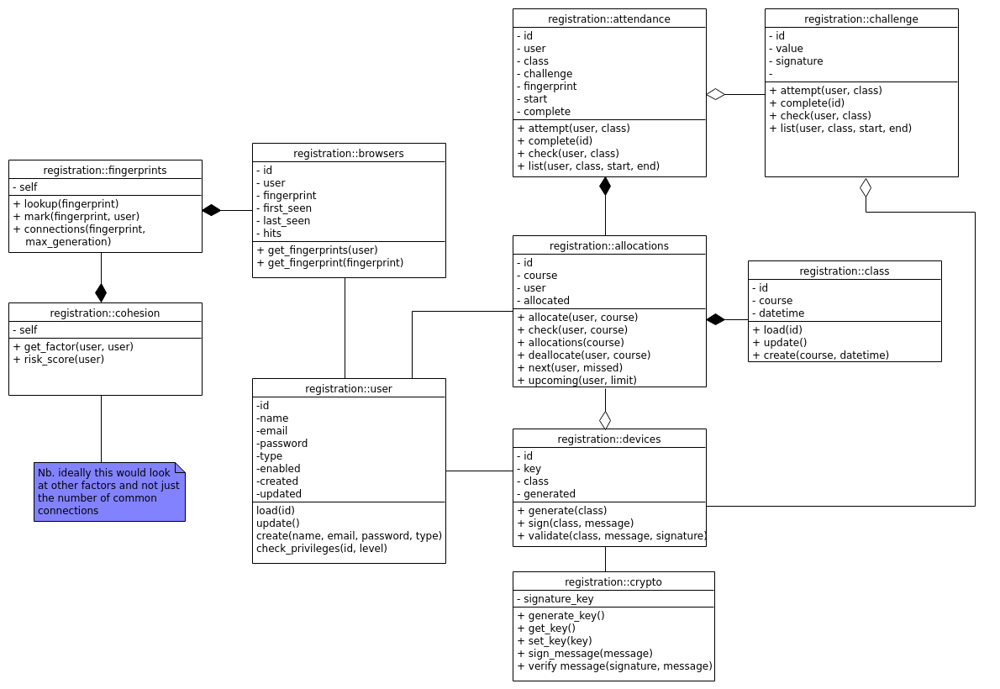

# Outline 

The proposed proof of concept replacement for both the paper registers will make use of modern web technologies to deliver a secure and trustworthy registration system that students can use on their mobile devices. This report lays out the design of the core components of the system and is intended to provide a full specification for the system being built with justification for the various design choices.  

# Components 

### Useful terminology 

To aid reading I have taken the liberty of naming and/or abbreviating a number of key components; a short glossary is therefore included. 

**Bluetooth device:** In the context this refers exclusively to the Raspberry Pi module that lecturers provision and bring to the lecture for students to authenticate against. 

**Cryptogram:** A challenge that has been signed. This can refer to either the challenge signed by the backend, _or_ the challenge signed by the backend and the Bluetooth device. 

**Class:** A single lecture with an immutable start time. This has a course code (to which an arbitrary number of classes can be created). Students and lecturers are allocated against a course arbitrarily. There is no concept of academic or calendar year. 

**Fingerprint:** The browser fingerprint calculated by the frontend JavaScript. 

**Certificate bundle:** The keys and other data generated by the backend for the Bluetooth device to sign data provided by student devices. 

**MVP:** For the purposes of the project, a Minimum Viable Product will be produced. This is enough to prove the concept and related technologies, but is cut down and not production ready. 

## Webservices 

The proposed application is primarily a webservice which is made up of two components: a backend server for processing and storing data, and a set of frontend webpages which will allow users to interact and manage the application. 

There is a choice between whether to use backend driven views or one of many JavaScript web frameworks (such as Vue, React etc.); which provide a more interactive and arguably seamless experience. These frameworks use static HTML pages served by a CDN (Content Delivery Network) which then utilise APIs provided on the backend to populate the pages on demand and deliver a richer user experience. This method of API centric design also reduces coupling of the user views with the underlying classes and models on the backend. However, these frameworks can be complex to use, require more careful design and provision of a rich API, and do create their own issues; for instance the use of JavaScript can be a drain on the viewing devices' system resources. For this basic proof of concept only a basic website is required with limited user user experience and design, and thus decoupling the frontend and the backend is not considered worthwhile. 

Instead, the backend will fill pre-designed HTML templates and serve them to the browser in a more traditional way. This does increase server load but as mentioned, increases coupling and reduces overall system complexity. 

As originally specified, the backend will be based on a Python application. Python is a high level interpreted programming language which is well supported in web development (with various web frameworks) and with many well maintained libraries (for instance, the ECDSA library). The version used will be the current Python 3 (2.7 was recently deprecated) and which has binaries for most modern operating systems (Linux, Windows MacOS). Python web services can be developed locally (eg. on the developers machine) and can also be deployed to production servers. For this project it is not intended to deploy the application to a server; although the web frameworks discussed later do support WSGI (Web Server Gateway Interface - a convention in how web servers communicate with the actual web application) so with a full CI/CD pipeline, automated deployments are possible. 

In order to efficiently develop a web application with both a basic API and serving webpages a web framework will be used. A short analysis of two options is provided: 

#### Flask

Flask is a lightweight web application framework which supports the WSGI and can thus be easily deployed with most common web servers (Nginx, Apache) (@pallets_welcome_2010). Whilst Flask does provide support for Jinga (a Python templating engine) and thus can easily support the rendering of HTML views on the backend. Being a more lightweight and "lower level" framework, Flask provides a significant latitude to the developer allowing quick and easy development; however potentially allowing the cultivation of poor software engineering practices. It is therefore important to understand the full set of features provided by Flask, it's design patterns and the Pythonic approach - this is all covered in the documentation (@pallets_welcome_2010). 

#### Django 

Django is a higher level more feature rich web framework. By default it provides tools such as a database abstraction layer, form validation, authentication controls etc. These provide a lower barrier to entry and are well maintained within the ecosystem, reducing the boilerplate required to get started and enforcing best practice and security by default. However, the prescriptive nature of the framework requires you to design your webservice in a specific way and use specific Django features. As mentioned, this can pay off in the long run by providing better maintainability, support and more predictable code (through use of a standard set of libraries) but does restrict development to the "Django way". 

--- 

For this proof of concept I will use Flask. This will provide a very simple base on which to integrate my classes and although it will require writing additional boilerplate (eg. for a login system), as this is a proof of concept scope creep can be avoided through a clear design from the outset. 

### Webservice UML 

### Webservice Pages 

The following pages will be provided at the following URLs as an HTML user interface, as discussed above. 

**/login**

Form with entry for email and password to login. 

**/signup** 

Exists purely for the PoC, to allow an easy method to add new users. Will allow setting of all parameters including privilege level 

**/dashboard** 

Will display different data depending on privilege level. 
- Students will see their current overall attendance percentage, upcoming lectures and missed lectures 
- Lecturers will see their classes and attendance percentages for each class, their upcoming lectures and attendance percentage for recently held lectures 
- Administrators will see students with high levels of poor attendance 

**/register/{class_id}** 

Only accessible to students, starts the challenge-response flow and redirected to from their dashboard. 

The frontend JavaScript is discussed in more detail later on, however as an overview an asynchronous request will be made to the backend to start the process and obtain the backend cryptogram. The cryptogram will then be signed and returned by the Bluetooth device and the result submitted by POST redirection to an endpoint for validation. 

**/provision/{class_id}** 

Only accessible to lecturers, this will generate the certificate bundle needed by the Bluetooth device for operation in that lecture. 

**/create/class** 

Only accessible to administrators, this allows the creation of classes for a specific time, against a course code. 

**/assign/student/{user_id}** 

Only accessible to administrators, this allows a student to be assigned to a course code. 

**/assign/lecturer/{user_id}** 

Only accessible to administrators, this allows a lecturer to be assigned to a course. 

### API

A basic API will be provided to facilitate the frontend asynchronous requests. It may be useful to provide some other endpoints, but these are not in scope for now. 

**/api/authenticate** 

- Method: POST 
- Parameters: Client ID, Secret 
- Returns: Access Token, Expiry 

**/api/registration/start**

- Method: POST
- Parameters: Client ID, Access Token, User, Course, Browser Fingerprint 
- Returns: Challenge ID, Challenge

--- 

For form submissions, session cookies will be checked upon submission to the endpoint at prefix **/api/forms/**. 

## Frontend (JavaScript)

The frontend will be based on the proof of concept programs developed previously. Two major pieces of functionality are planned: 
- Browser Fingerprinting 
- Bluetooth device functionality 

The browser fingerprint will be calculated using the ClientJS library as it provides a more stable result (based on limited testing). 

The Bluetooth device functionality will be developed using the experiments in the Web Bluetooth API and the device ID will (for now) be hardcoded in the frontend to the specific development device in use. 

## Device 

The Bluetooth device will be based on the Python ECDSA wrapper proof of concept, as the backend alongside the basic serial connection to the Bluetooth chip. It will read and verify the certificate bundle, import it and sign any data sent to the Bluetooth chip before returning it. 

For MVP purposes, the Bluetooth device will sign and return any data sent to it - this may be improved to perform some kind of validation, time permitting. 

# Acknowledgements 

Thanks to @marco_torchiano_how_2015 for the Pandoc table preamble and @cohen_third_2013 for the Final Year Project guide and suggested layouts. 

\pagebreak 
\onecolumn 

# Bibiography 

<!--
Due to the nature of this project, available references on the subject are limited and will be confined to more general information security concepts as well as attendance monitoring. In this report the available references are provided by those who have investigated these devices beforehand. 
-->

