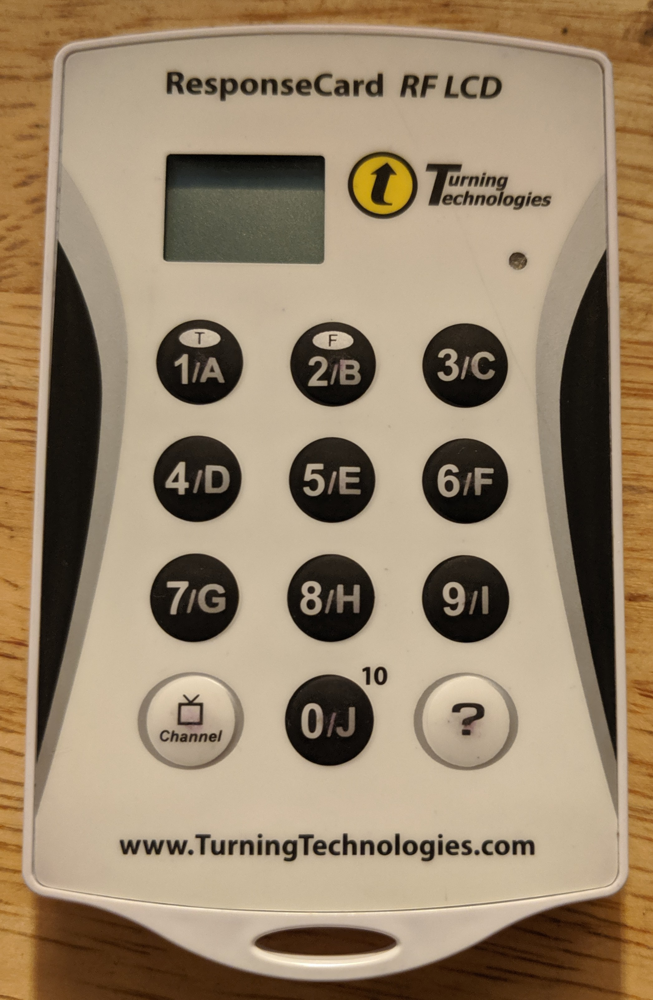
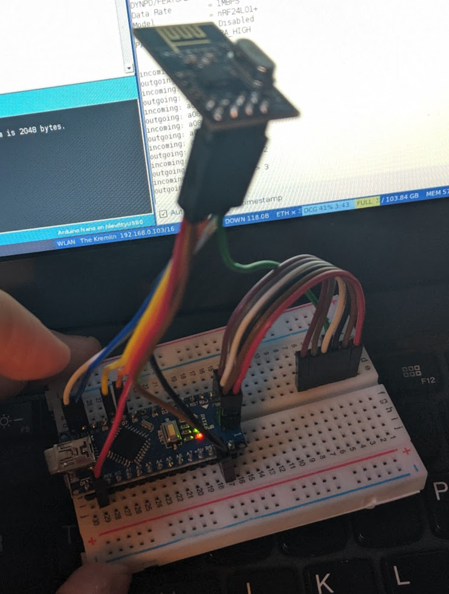
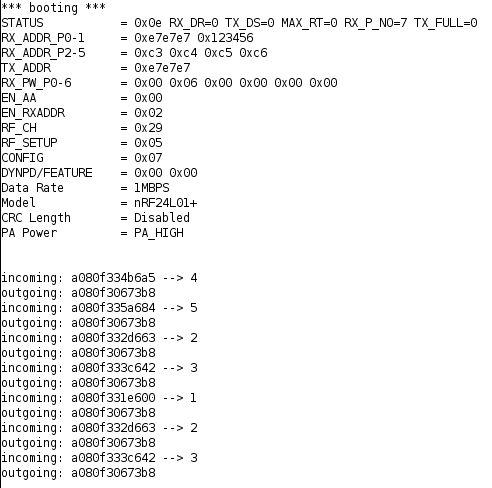
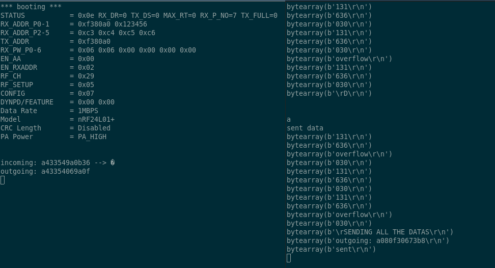
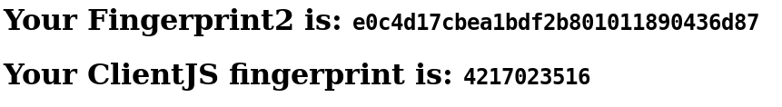
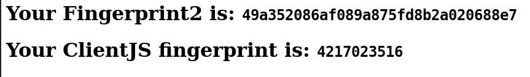
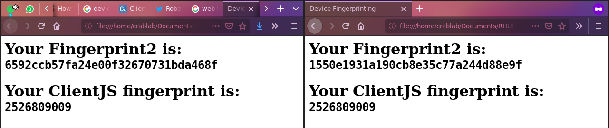

# Abstract 

<!-- 1. A section motivating the project and giving the original project aims.
This section must include a description of how you think that the work involved in your
project will help in your future career. -->

The aim of this research is to investigate existing attendance monitoring solutions and existing academic research into the problem to determine a more optimal solution for Royal Holloway. An MVP (Minimum Viable Product) will be built to test assumptions and demonstrate the core ideas of the proposed solution. The system will need to be user friendly and satisfy Royal Holloway's requirements whilst also not becoming burdensome on lecturers, students and administrative staff. 

# Introduction 

Royal Holloway keeps track of attendance in lectures both to ensure that students are regularly attending and also to satisfy legal requirements regarding the visas of overseas students [@home_office_uk_government_tier4_2019]. It is essential that this data is gathered and analysed efficiently and accurately.

In the past attendance has been tracked using signatures on registers. More recently, due to the lack of scalability of this former approach, a system of clickers has been employed [@royal_holloway_department_of_computer_science_department_2018]. This latter system has proved to be non-optimal and insecure. 

## Motivation 

The primary motivation is to offer a more secure and convenient system for students. The author is well acquainted with both the paper based and clicker systems in use, and the associated merits and pitfalls. An improvement in the process not only allows less detractions from the lecture content but, as @universities_uk_student_2019 writes: "Attendance monitoring can also be perceived as unfair and harm international student experience." - a more low key and low effort system reduces the potential for discrimination as a result of the perception of international students imposing rules on domestic students, as a result of their presence. 

@universities_uk_student_2019 continues, "The current system imposes a significant administrative burden on both institutions and the Home Office..." with a survey conducted by Universities UK concluding the the total cost of compliance with Tier 4 rules being £40 million to the UK Higher Education sector [@universities_uk_student_2019]. A separate study by @ey_challenges_2019 for the Russell Group noted "Attendance monitoring is particularly time consuming across such a large university with many different modes of study. Collating the data, analysing it and escalating cases for investigation/explanation has created an industry of work for very little tangible benefit given that HEI students are very low risk of visa abuse.". 

The work therein will develop my skills in using hardware and building production applications with proper software engineering practices. I intend to explore my interest in the Bluetooth specification and the hardware elements of the project to provide context to the information security focus. As I intend to take a Masters in information security this research is directly relevant to my future goals. 

# Research 

<!-- 6. A theory section. This might include a literature survey, sections on specific theory,
or even an interesting discussion on what you have achieved in a more global context. -->

## Background Theory 

## Clicker: reverse engineering 

At Royal Holloway, for the 2018 intake of first year undergraduates it was decided that due to the class size, paper registers were infeasible. The clicker systems was proposed and developed. This uses a Turning Technologies "Response Card" (Figure 1) typically used to respond to interactive questionnaires as part of a slideshow, or with other proprietary software. The device communicates with a base station connected to a computer via USB (Universal Serial Bus) when a key option is pressed (eg. "1/A") and transmits the unique ID of the device and the key press. The message is acknowledged by the base station and the user is given visual affirmation on the device that their response was counted. The results are then stored in a proprietary format attached to the slideshow which is decoded, processed and analysed by the department using a collection of scripts, Excel spreadsheets and custom software. 

The aim was to investigate the Turning Point clickers to learn more about how they work in practice and to see to what extent it is possible to reverse engineer, intercept and spoof communications between the clicker and the basestation. 



### Background Research

Whilst researching the device I discovered the work of @goodspeed_travis_2010 who reverse engineered a similar, but older device. This was achieved by dumping the firmware of the device allowing analysis of the way the device operated and how packets were structured and sent. A number of important discoveries were made: the System on Chip is a Nordic nRF24E1 chip, which is a Intel MCS-51 (8051 microcontroller) with an nRF2401 radio transceiver. The nRF2401 is a 2.4GHz, serial radio transceiver.[@nordic_semiconductor_asa_single_2004] The datasheet lists a number of potential applications including telemetry, keyless entry and home security and automation. The chip also uses what the datasheet describes as a "3-wire serial interface." - this is otherwise know as SPI (Serial Peripheral Interface) and allows easy interface with devices such as a Raspberry Pi and Arduino. 
Secondly, there is no encryption and in the aforementioned research it was noted through analysis of the firmware that the packets take the structure of three bytes target MAC, 3 bytes source MAC and then a single byte for the button selection. A CRC is calculated and added by the radio. 

This means that the source, destination and the parameter (the button pressed) are transmitted in cleartext with the only validation being a CRC (Cyclic Redundancy Check). The message is not signed, so there is no way to verify that a message has indeed come from the advertised source - this allows an attacker to arbitrarily spoof messages purporting to come from any source MAC address. 

### Cyclic Redundancy Check 

CRCs are a method of error checking that are widely used in serial communications[@borrelli_ieee_2001]. Traditionally, parity bits have been used to ensure data integrity across a communication channel. These indicate whether the data value is expected to be even or odd, but suffers from two major flaws. Firstly, it is not possible for you to determine where the corruption has ocurred in a piece of data - it is not possible to repair the message and it has to be discarded and resent. Secondly, if two corruptions occur then the data may end up passing the parity check but still be invalid. Additional measures (such as length checking, strict processing validation etc.) can be included to reduce the risks of bad data being processed. Whilst a parity bit is technically a 1 bit CRC (CRC-1), greater check values are now used as the greater bit value allows you to determine reliably how many bits have been corrupted and therefore protects against corruptions that fail to modify the overall parity. 

CRCs works using modulo arithmetic on some generated polynomials. The general formula to calculate a CRC is: 

$CRC = remainder of \left[ M(x) \times \frac{ x^n }{ G(x) } \right]$

Where `M(x)` is the sum of the message used as the coefficients in a polynomial. 

`G(x)` is known as the "generating polynomial" and is generally defined by the type of CRC you are using. For CRC-16 (which is the type used for the nRF24E1) `G(x)` is defined as: 

$G(x) = (1 \times x^{16}) + (0 \times x^{15}) + (1 \times x^{2}) + 1$

This produces a value (the polynomial) when is then used to divide `M(x)`, with the remainder used as the CRC. 

In this particular situation, it is possible to calculate the CRC on the nRF24E1 in the ShockBurst\texttrademark configuration settings by setting the `CRC_EN` flag bit. This means the chip will calculate and append the CRC as well as strip and validate the CRC on messages received.[@nordic_semiconductor_asa_single_2004] In the @mooney_nickmooney/turning-clicker_2019 implementation, CRC is calculated on the Arduino not on the nRF24E1 due to technical issues getting this working. The CRC is instead calculated and checked using an alternative library.[@frank_frankboesing/fastcrc_2019]

### Hardware

It is possible to use any Arduino and nRF24E1 breakout board for this project - I elected to use the Arduino Nano and the cheapest nRF24E1 board I could find on eBay. The Arduino is placed on a breadboard and the nRF24E1 connected via Dupont leads to the requisite pins. 



As always, this can be a somewhat complex operation and it did require consultation of not only the nRF24E1's advertised pin layout[@noauthor_1/2/3/5/10_nodate] but also a setup guide for a similar, but not identical product from Sparkfun [@noauthor_nrf24l01+_nodate].

The pinout I used is listed in Table {@tbl:table1}

| Name | nRF24E1 | Arduino |
|------|---------|---------|
| VCC  | 2       | 3.3v    |
| GND  | 1       | GND     |
| IRQ  | 8       | GND     |
| CE   | 3       | D7      |
| CSN  | 4       | D8      |
| MOSI | 6       | D11     |
| MISO | 7       | D12     |
| SCK  | 5       | D13     |

Table: The chosen pinout. {#tbl:table1}

With the addition of a mini USB cable to connect the Arduino to your computer, the hardware setup is complete. It is important to note that the hardware required for the base station emulator is identical to that required for the clicker emulator. 
 
### Installation 
<!-- potentially should go in user manual? -->

The setup of the software environment on the computer is relatively simple and is based around the Arduino IDE which is available from: https://www.arduino.cc/en/main/software. It appears there is now an online version, but this has not been tested with this project. 

Once the Arduino IDE is installed you should try flashing the Arduino with the example "blink" code, available from File $\rightarrow$ Examples $\rightarrow$ Basic. 

Assuming you have installed the IDE correctly and have specified the serial port and Arduino type a blinking status LED will be present.  

You can also compile and upload code from within other IDEs using plugins. VSCode has various plugins for this, setup of which is beyond the scope of this document. However, since it took me a while to discover this - it is important that you set up a VSCode Workspace so the Arduino Sketch file (containing running preferences such as the serial port, baud rate etc.) can be created and saved. Otherwise, you cannot upload any code. 

To run the project code, two libraries are required - RF24 (a library to handle communication with the nRF24E1) and FastCRC (to calculate the CRC checksums). 
For the former, Sparkfun have published a guide on installation the RF24 library into the correct folder in your filesystem: https://learn.sparkfun.com/tutorials/nrf24l01-transceiver-hookup-guide/arduino-code
The FastCRC library is installed in a similar fashion.

You should then be able to verify and upload the project code! If you get library errors, ensure the libraries have been imported correctly and the IDE shows them in the GUI. 

It is also important to note that the baud rate used in the project is 115200 - without that set correctly it will not be possible to communicate with the Arduino via the IDE's serial console. 

The Python scripts to manage serial communication with the Arduinos are designed to be run in Python3. No libraries not available via Pip are used, but what is installed by default varies per system so it is advised to try running the code and install any missing libraries as required. 

#### Frequent Issues

Two issues encountered and which took significant effort to identify the root cause of are included with some basic debugging. 

`avrdude: stk500_getsync() attempt 1 of 10: not in sync: resp=0x00` 

This error occurs when either:

- The Arduino is disconnected or cannot be connected to: check the USB
- The wrong Arduino type is selected: check the board configuration and the type of CPU used 

`Cannot upload: device/resource busy`

This occurs when the serial connection to the serial port is already in use. Ensure you don't have any serial consoles open, or any of the Python scripts running. 
If that doesn't work, you may be specifying the wrong serial port. 

It is possible to identify a process using a serial port with `lsof` and then terminate this process using `pkill`. 

### Clicker Basestation

The script to emulate the basestation of the clicker system is made up of two parts, the Arduino code and Python script. The former is essentially an unmodified version of the @mooney_nickmooney/turning-clicker_2019 file, which was developed a number of years ago. The interesting point here is that his work was developed on an entirely different device, and shows how widely this system has been deployed and the range of different devices available all using the same protocol. 
The Arduino code listens for a transmission on the configured channel and then checks the CRC (discussed above). It then prints out the received packet to the serial console and returns the "accepted" message to the clicker. This causes the clicker to flash a green LED instead of a red one to show  proper acknowledgement to a message by the basestation.

The Python script is substantially modified from the original @mooney_nickmooney/turning-clicker_2019 code and provides a basic serial program to interact with the basestation emulator. It connects to the serial port and parses the aforementioned outputs, before saving them to a specified output file in a CSV format. Because of the way the serial printing is formatted, regex is required - the expression is the work of @mooney_nickmooney/turning-clicker_2019. 

An example output from the Python script:
```
address_from,address_to,button
a080f3,31e600,1
a080f3,35a684,5
a080f3,396708,9
a080f3,396708,9
a080f3,387729,8
a08167,35459b,5
a08167,35459b,5
a08167,35459b,5
a08167,35459b,5
a08167,35459b,5
a08167,35459b,5
a08167,35459b,5
a08167,35459b,5
```

As you can see, the from address (the clicker address), the to address (the hardcoded basestation address) and the button pressed are included. This is a significant improvement on the output from the current solution as the output is in a text file format (CSV) which does not require preprocessing from a proprietary format. 

The output on the serial console is shown in Figure 3. 



### Clicker emulator 

The hardware for the emulation of a clicker is exactly the same as that required for a basestation - the difference is purely in the code and associated processing of data. My high level plan was: 

- Modify Arduino script to send to the hardcoded basestation address
- Modify Arduino script to take input of "sent from" addresses over serial 
- Write a Python utility script to feed the Arduino with clicker addresses to emulate 

I first decided to tackle getting addresses into the Arduino over a serial connection - it seems deceptively simple! I intially planned to use the `String` components of the Arduino `Serial` library - `Serial.readStringUntil`[@noauthor_arduino_nodate], for example. This had the advantage of avoiding having to worry about lower level buffer constructs and also allowed abstraction from having to handle reading from the Serial buffer until a certain point (end of string etc.). This did not work for a few reasons. The addresses being sent are actually binary values, usually represented in hexadecimal, and the String library cannot deal with this raw data. The "until" also proved to be somewhat unreliable and would not terminate necessarily on a line feed. This may well have been the product of other issues, however. 

If you cannot use the String abstraction, you have to handle raw `Chars` - these are individual bytes that you place into a buffer of suitable length. Arduinos use Harvard rather than Von Neumann CPU architectures so the data and system memory (RAM) are on different buses - this makes a buffer overflow exploit difficult, but not impossible. You do therefore need to be careful when handling buffers to ensure you do not deliberately overflow a buffer. 

The basic code (encapsulated in a loop) is as follows:

```
if(Serial.available() > 0 &&
    counter != BUFSIZE){

    char incoming = Serial.read();

    if (incoming == '\r') {
        
    } else {
        incomingData[counter] = incoming;
        counter++;
    }
}
```

When the Serial port is available and the counter has not reached the buffer size
    - Read a single character from the Serial port 
    - If it is a `\r` (line feed) then handle that case
    - Otherwise, place it in the buffer and increment the counter 

This is all well and good but you need to get an address over the Serial connection in the first place! Sadly, you cannot just send `OxA0` - by doing so you are sending the literal ASCII codes for each individual char (eg. `A` = 65) you need to send the "hex values" for each byte, which is then a single char. One way to get a hex ASCII value is via `echo -ne "OxA0` which will print out the char you want. Sadly, when I sent this to the Arduino (using Screen) I ended up filling the buffer several times over with values that were completely unrelated. I still do not understand the cause of this issue - I suspect it may have been triggering some Screen escape codes. 

I then moved to using a Python script which was more easily rerun. In order to both read and send data over the Serial connection I had two threads one to receive data and another to send characters as required. This was based on a StackOverflow post and used some example code, but the concept is not complex. In order to be able to both send and receive characters on a serial line in Python you need at least two threads - one to process anything received on the serial line and print it to the console, and another to send data when instructed without blocking the receiving thread: 

```
conn.write(str.encode("160"))
conn.write(str.encode("160"))
conn.write(str.encode("160"))
conn.write(str.encode("\r"))
```
 
This more predictably populated the buffer at the other end, as shown in Figure 4. In the clicker basestation you can see one packet received - this is from other (presumably IoT) devices that use the same channel and addressing structure. You can also see the attempt to send data on the right with the various interesting echos back with different values to that which are sent, from the Arduino. The one outgoing packet shown to be sent was actually hardcoded and exposed another bug. 



It turns out that although the outgoing packet is correctly formatted (when compared to incoming packets from a clicker as received by the emulator basestation) no packet is actually sent, or at least received at the other end. This is a fairly critical error and I think may stem from my misunderstanding over how the code works (which address is which). I have not yet resolved this and I may not - I am quickly going down a rabbit hole of ASCII encoding already. 

### Conclusion 

I successfully implemented (using code from @mooney_nickmooney/turning-clicker_2019) a clicker basestation and associated Python script which I believe actually has a practical use, to replace the current PowerPoint slide system. 
The emulation of the clickers themselves has proved more tricky and the adaptation of the code to spoof packets has been difficult. However, the reception and decoding of live packets has shown that the protocol is vulnerable to a programmatic attack in this way and, if nothing else, is vulnerable to a simple replay attack of a recorded transmission.  

## Browser Fingerprinting 

Tracking a user within a website (or indeed across the internet) has been possible either by checking the IP address of the origin or by use of cookies for state management, the mechanism of which was described in the 1997 RFC [@kristol_http_nodate]. As part of the new clicker system it is envisioned that some method of identifying the device the student is signing in on will be required, to allow detection of one device signing multiple people in. The IP address is too general - those connected to college WiFi or using the same network and mobile phone mast would have identical IP addresses, session cookies can be set to have long expiries but a user can remove them from their browser regardless. In order to track devices with some degree of certainty, it is therefore necessary to look at alternative means of identification. 

This type of tracking is not uncontroversial. From 2012 to 2014, Verizon (a US network carrier) injected unique identifiers into network traffic without their customers being aware of such 'supercookies' being attached to their data. [@brodkin_verizons_2016] [@noauthor_verizon_nodate] It transpired that not only were Verizon using these supercookies themselves, but third parties had discovered their existence and were using them to track individual devices for purposes such as advertising. The FCC's investigation determined that Verizon should have sought explicit opt-in consent from customers for the direct sharing of what the FCC referred to as UIDH (unique identifier headers) and given the option for customers to opt out of their use by Verizon internally. A specific case cited related to a third party advertiser using supercookies to continue tracking customers after they had explicitly removed normal cookies from their devices. In the UK, the European Union General Data Protection Regulations apply. The law contains specific provision for what it calls "Special category Data". This is "personal data which the GDPR says is more sensitive, and so needs more protection." [@gov.uk_guide_nodate] and includes "biometric" data which traditionally has been used to refer to specific human characteristics (such as retina data) however could arguably be applied to specific characteristics of a device a user owns; in the same way that an IP address is considered Personally Identifiable Information.[@noauthor_eur-lex_nodate] The Electronic Frontier Foundation run an online service, @noauthor_panopticlick_nodate, which will attempt to fingerprint your browser in a sandbox, displaying the results. Their test, however, is somewhat dated as @boda_user_2012 observes - relying on Flash or Java plugins to properly fingerprint the available fonts. They also note the potential for plugin detection - where the available plugins to the browser are queried and used as identifiers - given how unique the combination can be. 

Browser fingerprinting takes various characteristics within a browser via the JavaScript API (and formally via Flash and Java virtual machines too) and uses these to essentially narrow down a browser to a very small intersection of sets. Taking a simplistic example, a browser with resolution of 1080px by 760px might have 100 possible other configurations, if we then also include the CPU class that might narrow down the intersection to 50 devices. Then taking the system language it might be possible to reduce the intersection to 40 devices, and so on. On their own, these identifiers are not unique - it is only when they are combined that you reduce the probability of finding another device with an identical configuration. There are some examples [@mozilla_browser_nodate] of identifiers that might be used:  

- `browserSettings.openUrlbarResultsInNewTabs`: whether URL bar autocomplete search results open in a new tab or not 
- `browserSettings.homepageOverride`: the current value of the home button URL 
- `runtime.PlatformOs`: the platform Operating System 
- `runtime.PlatformArch` the platform architecture 

These seem fairly obvious but there are more advanced techniques such as HTML5 web canvas and WebGL fingerprinting. WebGL is a graphics API that allows the programmatic drawing and rendering of images on a canvas.[@kobusinska_device_2017] The technique used is to draw an image onto the canvas and then convert the result back into text which can be compared against other results to determine uniqueness. In this particular study the large changes seen in a controlled environment and relatively large execution time led that WebGL fingerprinting contained too much entropy to be useful as an additional identifier to measure. The @kobusinska_device_2017 method was not described in detail however a novel approach was presented by @MS12 which utilized both HTML5 and WebGL. Key to their approach was the rendering of text which they matched against known samples (using automated methods that are not relevant here) - this was done with both WebFont (HTML5) and standard font face rendering. The WebGL test used a black and white image containing 200 polygons - derived from the ISO 12233 standard - and the various rendered images were then subtracted from a control to give a "diff" between the generated outputs for each browser, which could then be compared. The paper contains some illustrations to demonstrate the point. 

The actual result from a browser fingerprint is a hash of all of the attributes selected to identify the browser. This hash can then be stored, to be checked against future computations of the hash. As @ashouri_large-scale_nodate notes into research reverse engineering fingerprinting solutions, these hashes are increasingly calculated server side with the raw values extracted sent to the server. Not only is this not ideal as there is a significant transfer of quite sensitive data, but the calculations are carried out in a black box that cannot be analysed. Another variant mentioned by @ashouri_large-scale_nodate is commercially available scripts that are loaded from a third party, returning the result directly to them for analysis and  storage. An example here is provided by Adyen[@noauthor_device_nodate] who provide customers with a script used to calculated a browser fingerprint, for the purposes of their own internal fraud prevention and 3DSecure Version 2.  

### Proof of Concept 

There are two commonly used and freely available libraries for calculating browser fingerprints - Fingerprint2 [@v_valve/fingerprintjs2_2019] and [@noauthor_clientjs_nodate], the latter of which implements some of Fingerprint2. 

In order to test both libraries I designed a simple HTML webpage with some basic HTML elements to visualize the fingerprint outputs. I subsequently wrote according to the respective manuals some basic fingerprinting for both Fingerprint2 and ClientJS. 


It is important to note the timeout is set to allow a certain amount of time for the page to load, as partially loaded pages generate inconsistent fingerprints. 

In Figure 1 you can see a demonstration: 


Upon a refresh in Figure 2 you will note that the ClientJS fingerprint remains static, whilst the Fingerprint2 example does not. The exact reasons for this will be down to the specific parameters each chooses to use in fingerprinting. There are many options - it would take a long time to fine tune these algorithms! 


I also compared the outputs in an incognito window and  in Figure 3 again the Fingerprint2 results do not match, whilst the ClientJS fingerprint has correctly identified the browser - despite it being in incognito mode and therefore with no cookies and no tracking. 


Finally in Figure 4, I compared the results across two browsers - Chrome and Firefox. Both Fingerprint2 and ClientJS identify them as different browsers, which is to be expected! 


## Bluetooth 

In order to allow students to mark their attendance conveniently and efficiently, we look at potential wireless solutions including MIFARE Classic. 

### Overview 

One of the key advantages that the clicker system had over the registers was that it utilise wireless communication such that students could 'click in' on a short range handheld device, rather than pass around a physical register sheet. The range of the clickers is advertised as being around a 200ft radius [@noauthor_c21_nodate] which in the context of a lecture theatre, is actually quite large! Based on practical experience (and not wishing to go down a rabbit hole to find out definitively), I postulate that for most lecture theatres that would include the entire room plus a short distance outside - taking into account the attenuation of the signal through the walls. 

Considering the range of other wireless communication technologies: 

- Radio Frequency Identification (RFID): a maximum of 20ft [@nikitin_performance_2006] with a passive tag. 
- Near Field Communication (NFC): a few centimeters [@fischer_nfc_2009] 
- Bluetooth: "short range" [@heydon_bluetooth_2013]

### Student ID Cards


At the beginning of the 2019 Winter Term, the College began issuing new student ID cards and reissuing older cards. The new cards were found to contain a MIFARE Classic chip (Figure 1). The MIFARE chip was originally released in 1994 by what became NXP [@mayes_mifare_2010] as a product primarily for mass transit cards, but also later for door key cards and the like. The MIFARE design was very proprietary with only the (48 bit) key length disclosed to the security community. For example, the chip used an undisclosed encryption algorithm developed by Phillips (who became NXP) that had not been researched or investigated by the wider security community. [@mayes_mifare_2010] As is well accepted in Kerckhoff's Principle [@kerckhoffs_cryptographie_nodate], we should always assume the attacker has the maximum knowledge of the system including details of the encryption algorithms used, nonce generation algorithms and other design features. The only item assumed not to be known by default is any private keys generated. This principle ensures that any tendency to default to "security by obscurity" is avoided as, as in the case of MIFARE, if your security model relies on design details being disclosed it is very vulnerable to espionage, reverse engineering or simply errors in parties disclosing too many details. 

In December 2007 at the Chaos Computer Conference [@nohl_mifare_nodate] [@nohl_reverse-engineering_nodate], a presentation was given where researchers presented analysis where it was demonstrated it was possible to generate the nonces used in the chip (as the randomness is determined by the number of clock cycles since the chip is initialized) and by analyzing 27 of mutual authentication captures repetition of the challenge response was observed. It was also shown by trial by error in bit flipping the unique identifier transmitted by the card was linked to the keys used and such there exists for each session key as a result of the mutual authentication, for a given key and unique identifier. This allows recovery of the key used based on the unique identifier presented by the chip and the challenge response sent.  

This has been developed further and it has been possible to generate key rainbow tables (as they only have a 48 bit length) and use these tables to carry out brute force searches on encrypted sectors for arbitrary cards. Note in the dump in Appendix 1 sector 6 is unreadable - this is the secured sector for which a key is needed for the reader to access the sector. Using software implementing the later nested attack on MIFARE [@noauthor_nfc-tools/mfcuk_2019] and an Android application to interrogate the card [@klostermeier_ikarus23/mifareclassictool_2019] it was possible to recover this sector: 

```
30313836343536342020202020202020
00000000000000000000000000000000
00000000000000000000000000000000
------------7877880045FA49A0C327
``` 

Where, `45FA49A0C327` is the key, `7877880045` the Access Control bits and the hexadecimal beginning `303138...` the stored data. Converted from hexadecimal to ASCII it reads `01864564`, which is my student ID number (as printed on the front of the card). With the key it is possible to rewrite any student ID card (or any MIFARE Classic card for that matter) with any ID number, or arbitrary data. Through a separate vulnerability, it is possible to retrieve any card ID number from the College LDAP extended attributes. So, it is possible to write any of these cards (used for access control, payments etc.) with any ID number and they offers no security above the magnetic stripe technology in use on the older cards.  

I therefore propose not to use the student ID cards for authentication, as they are demonstrably insecure with little knowledge of the MIFARE technology or cryptography. 

### Bluetooth Low Energy 

_Section with reference to @gomez_overview_2012, @heydon_bluetooth_2013, @townsend_getting_2014 and @bluetooth_sig_specification_2010. Given the former books are drawn from the specification and crossover is large between all three sources, exact citation is not provided._

In the 4th Edition of the Bluetooth Specification [@bluetooth_sig_specification_2010], issued by the Bluetooth Special Interest Group the Bluetooth Low Energy devices were introduced. These devices were to in addition to what is known as Bluetooth Classic - the most well known version of Bluetooth used in all manner of consumer accessories from headphones to keyboards, and now adopted in scientific and industrial applications. Three classes of devices were available: Bluetooth Classic (only), Bluetooth Low Energy and Bluetooth Smart Ready; the latter supporting both Classic and Low Energy protocols. The intention behind Low Energy was to go almost in the opposite direction to Classic - a very low bandwidth device which would not remain constantly connected designed around applications that issued sporadic commands to retrieve data or initiate control sequences. In comparison to Bluetooth Classic at the time, Bluetooth Low Energy has a theoretical bandwidth of 1MB/s vs 54 MB/s with Classic [@heydon_bluetooth_2013] [@gomez_overview_2012]. Low Energy operates on the 2.4GHz frequency band with a channel spacing of 2MHz (40 channels) with 3 channels dedicated for advertisement broadcasts - channels 37, 38 and 39 [@townsend_getting_2014]. In order to minimize interference with other Bluetooth devices and other standards on the same frequency (WiFi, Bluetooth Classic, ZigBee) frequency hopping is used where the channel is changed upon each interaction based on the following formula [@townsend_getting_2014]: 

```
channel = (curr_channel + hop) mod 37
```

The `hop` is predetermined at the initial authentication with the Bluetooth device and remains constant throughout the life of the connection. 

Gaussian Frequency Shift Keying (GFSK) is used as the modulation for transmitted signals. This is fairly common for devices operating on the 2.4GHz band and was filed for patent in 1998 @hsiang-te_ho_us6480553.pdf_nodate. When radio signals are transmitted they are modulated (mixed) with a carrier signal at the frequency of transmission. GSFK uses a filter based on the Gaussian function. The exact reasons for doing this are beyond the scope of this report, but they relate to reducing the effects of interference during transmission. 

The Bluetooth 4.0 specification defined two actors: a master and a slave. During the asymmetric connection process, the slave advertises itself on the advertising channels with a 31 byte packet. It is possible to send an additional 31 byte packet with additional data upon interrogation by a Master (sending a Scan Request packet) - this is Active Scanning and Passive Scanning is merely monitoring the data sent on the advertising channels. 

```{=tex}
\begin{figure}
    \centering
    \begin{sequencediagram}

    \newinst[1]{A}{Master}{}
    \newinst[2]{B}{Slave}{}
    \mess{B}{Advertising Data}{A}{}

    \postlevel

    \begin{call}{A}{Scan Request}{B}{Scan Response}
    \end{call}

    \end{sequencediagram}
\end{figure}
```

In Bluetooth 4.0 the slave may be connected to one master device with master devices permitted to connect to a number of slave devices. This was updated in version 4.1 of the specification [@bluetooth_sig_specification_2013] to allow slaves to have multiple connections to a master at any one time, although slave to slave communication remains unsupported. Low Energy uses Time Division Multiplexing to achieve long periods with the radio off (to conserve power) transmitting and receiving packets only at pre-determined intervals. This can give a battery life measured in years, but does mean the bandwidth is limited, as previously discussed. 

The Bluetooth stack uses L2CAP (Logical Link Control and Adaptation Protocol) at second lowest level of the stack (the Physical Layer handling the modulation and transmission of packets is below) and this is responsible for the assembling of packets and managing the Physical layer to ensure downstream units, such as the HCI, are not overwhelmed. 

Bluetooth defines a number of modules including the Generic Attribute Profile and the Generic Access Profile, which help abstract services away from the hardware and provide common interfaces between devices. The exact mechanisms of these and the general design is beyond the scope of this report - we simply accept that the Bluetooth specification provides these services for our convenience. 

However, the security mechanisms provided are of interest especially given the weaknesses noted in MIFARE. 

#### Security Manager

One module is the Security Manager which handles the mutual generation of keys for encrypted communications and interfaces with the L2CAP module and is only present in Low Energy devices (in Classic device it is integrated in the Controller). Using hardware modules it is able to provide various cryptographic functions for the key exchanges. 

The security function used is an AES-128-bit block cipher. The Advanced Encryption Standard [@national_fips_2001] was chosen as a result of a RFP issued by the United States National Institute of Standards and Technology looking to replace the then aging and provably broken Data Encryption Standard (DES), developed many years before. The algorithm chosen was Rijndael [@daemen_rijndael_1999] and operated on 128, 196 and 256 bit blocks and is a symmetric cipher. AES works by applying a round function to the data input using the expanded key as a state. On each round a byte substitution, then row movement and finally column function is applied to the data. Each round the designed part of the key is XOR'd with the state. There are 10, 12 or 14 rounds dependant on key length and the last round does not mix the columns. Applying the algorithm in reverse is possible and allows decryption of the ciphertext.

When Bluetooth devices are paired an STK (Short Term Key) is generated to encrypt data symetricall with AES in transit. Pairing is carried out via three methods: 

- Just Works: values to generate STKs are exchanged with no encryption over the link offering no man-in-the-middle protection. Interception of the values allows an attacker to generate their own copy of the STK and decrypt and potentially spoof further communications. 
- Passkey: a 6 digit numeric code is assigned to the Slave device and on pairing the Master requires user input of this code which is then used to generate a key to encrypt exchanged values for the STK generation. 
- Out of band: values are exchanged outside of the Bluetooth protocol to allow encryption of the values to generate the short term key. 

It should be noted that in the proposed implementation, Just Works pairing will be used. It is possible to use Passkey pairing however since each student would know the identical code it would offer no protection against them intercepting their own packets and thus has negligible security benefits as they are the main adversaries. There are technical limitations to dynamically changing the Passkey on Bluetooth Low Energy Slaves and this is currently not properly supported. 

### BLE Device Investigations

Investigations into practical applications and small projects with Bluetooth Low Energy yielded several articles mentioning the HM-10. [@loginov_how_2019] The HM-10 is based on a Texas Instruments BLE System On Chip mounted as a daughter board to breakout a serial UART connection. At this time only BLE devices are officially supported via the Web Bluetooth APIs. [@webbluetoothcg_web_2019]


As this device provides a serial interface, an additional microprocessor will be required to interface with the device and to receive, process and then respond to data sent to the device. A Raspbery Pi was chosen over an Arduino due to the increased processing power, onboard networking and full operating system. This also allows for higher level languages like Python to be used instead of C++, speeding up development. As no analogue inputs are required there is no real advantage to using an Arduino here. A Rasperry Pi Zero was configured to run in headless mode with a terminal over USB [@gbaman_simple_nodate] however it transpired that whilst the Raspberry Pi does have two UARTs available, one is used for the onboard Bluetooth and the UART used for the Linux console is shared with the UART exposed on the GPIO. [@noauthor_raspberry_nodate] It was therefore necessary to change approach and a Raspberry Pi 2B was provisioned with SSH enabled (add an empty file: `/boot/ssh`) was configured such that direct a ethernet connection to the laptop was possible, with ethernet passthrough to the laptop's wireless connection. 

The HM-10 was then attached with Dupont leads to the GPIO of the Raspberry Pi using pinouts for the Pi and the markings on the HM-10 breakout board. [@noauthor_pi4j_nodate]


Initially, the device was detected on the serial port and a connection could be established. However, there was no data sent by the device and no acknowledgement of data sent down the serial port. The HM-10 uses AT commands which are commonly found in GSM modules and the like - the HM-10 likely uses these given the industry crossover. The manual for the HM-10 [@jnhuamao_technology_company_hm-10-datasheet.pdf_2014] lists a few basic AT commands which can be used to interrogate basic data such as the device status: 

- `AT` should return the device status: `OK` or `OK/LOST`
- `AT+ADDR?` should return the device MAC: `OK+ADDR:{MAC address}`

The datasheet also describes that a string over 80 characters should be sent to take the device out of standby. The string data is not relevant, just the length. 

The manual states the serial parameters are:

- 9600 Baud 
- No parity 
- 1 stop bit 
- 8 bit byte length 

A few attempts were made using these settings and different serial decoders (Minicom, Screen) - no response was received. Appendix 2 contains an output from Minicom for one attempt (including configuration). 

It transpired that AT commands are actually a time based command set. They do not rely on a carriage return or line feed to indicate the end of a command, but they do timeout - within 100ms usually. [@milosevich_at_2006] A timeout on a valid command will cause the command to be executed and the result returned - an invalid command may generate no response at all. 

Looking at the Raspberry Pi forums identified a small number of questions relating to this, including a thread where a user had reported some working test code. [@noauthor_how_nodate] The code is actually very trivial - it opens a serial connection with the correct parameters and then sends data before listening. Because AT commands use a 100ms timeout it is not necessary to run two threads to send and receive data - after sending a command it is simply necessary to wait for any data on the serial buffer for 100ms before continuing. I modified the script to: 

- Send the long string (above 80 characters)
- Send the `AT` command and listen for a response 
- Send the `AT+ADDR?` command and listen for a response 

The script is provided in Appendix 3. 

Running this script several times with different RX/TX pin configurations and baud rates did not yield any results and the only success was some null bytes, as in Figure 4. 


Reading around the UART protocol, it transpired that flow control is sometimes required for devices. [@mark_duncombe_is_nodate] Flow control is used to indicate to the other party when it is 'safe' to send data and when it is not. As UART is so ubiquitous it is likely there will be cases where the buffer size and the processing capabilities between devices is vastly different. To prevent more capable devices flooding low powered devices (either leading to lost data or exceptions) the crosscoupled `state` (RTS) and `enable` (CTS) supplement the data lines and when a device needs to inhibit further data it will bring the `state` line to Logic 0 (`enable` on the partner device). [@silicon_labs_an0059.0:_2017]

The Raspberry Pi does support hardware flow control, however enabling it is non-trivial and it was not possible to enable it in Minicom, after looking into several methods of enabling it. [@vince_deater_raspberry_nodate]

Upon speaking with Dave Cohen and investigating further it was suggested that as the RX pin of the HM-10 was technically 3.3V, providing a 5V signal could cause issues. A potential divider was tried but this also failed to resolve the issues. [@martyn_currey_hm-10_2017] It also appeared that later versions of firmware used the higher 15200 baud rate - this was also tested. 

It was also observed that using a BLE Scanner Android application (Figure 5), it was possible to connect to the HM-10 and read out the GATT data - no acknowledgement of the connection was observed on the serial port as expected and documented. This suggested the device was, in part, functioning as expected. 


Up until this point, two HM-10 devices from the same source had been used. Due to the issues encountered another was procured from an alternative supplier. Upon swapping it like for like with the other HM-10, it worked first time with the script provided in Appendix 3. This does validate that this was a hardware issue rather than "user error" however the exact issue is unknown. 


Using a BLE Terminal app it was then possible to send data via the HM-10 to a running screen session as in Figures 8 and 9:





Focus is then on integrating this with the Web Bluetooth APIs to transmit data from a browser down to the Bluetooth device. 

The support for the Web Bluetooth APIs is rather more limited than I had believed and only Chromium and Opera offer any support for the APIs. [@mozilla_web_nodate] The officially updated development progress can be found [here](https://github.com/WebBluetoothCG/web-bluetooth/blob/master/implementation-status.md).

Based on a development guide from Google (written by a member of the Web Bluetooth Community Group) [@francois_beaufort_interact_2015] a very basic solution was developed (Appendix 4) and there are several items to note. 

The Web Bluetooth API requires user interaction on the page before scanning can even take place, and in any event the user needs to explicitly provide consent to pair with a device via a prompt. In the solution, an `onClick` event from a button is used to call the function. Once called the function scans devices and looks for an explicit unique identifier for the specific HM-10 in use (transcribed from the BLE Scanner app): `0x484D536F6674`. It is possible to apply filters based on GATT characteristics however for simplicity this is avoided. The name of the device should then be logged, and the pairing sequence initiated (requiring user confirmation). 

Web Bluetooth is so experimental that it requires enabling a Chromium feature flag [@noauthor_web_nodate] and on Linux, enabling an experimental flag for Bluez [@acassis_how_2016]. 

At the moment issues with Chromium detecting available Bluetooth cards via Bluez persist (Figure 10) and it has not been able to properly test the solution. Trials with other operating systems may be necessary to have a working Proof of Concept. 



# Design and Software Engineering

<!-- 7. Sections describing the software engineering method that you used. If your project is
based on a software product then this may even be most of your report. -->

## Initial Design

The proposed proof of concept replacement for both the paper registers will make use of modern web technologies to deliver a secure and trustworthy registration system that students can use on their mobile devices. This report lays out the design of the core components of the system and is intended to provide a full specification for the system being built with justification for the various design choices.  

## Components 

### Webservices 

The proposed application is primarily a webservice which is made up of two components: a backend server for processing and storing data, and a set of frontend webpages which will allow users to interact and manage the application. 

There is a choice between whether to use backend driven views or one of many JavaScript web frameworks (such as Vue, React etc.); which provide a more interactive and arguably seamless experience. These frameworks use static HTML pages served by a CDN (Content Delivery Network) which then utilise APIs provided on the backend to populate the pages on demand and deliver a richer user experience. This method of API centric design also reduces coupling of the user views with the underlying classes and models on the backend. However, these frameworks can be complex to use, require more careful design and provision of a rich API, and do create their own issues; for instance the use of JavaScript can be a drain on the viewing devices' system resources. For this basic proof of concept only a basic website is required with limited user user experience and design, and thus decoupling the frontend and the backend is not considered worthwhile. 

Instead, the backend will fill pre-designed HTML templates and serve them to the browser in a more traditional way. This does increase server load but as mentioned, increases coupling and reduces overall system complexity. 

As originally specified, the backend will be based on a Python application. Python is a high level interpreted programming language which is well supported in web development (with various web frameworks) and with many well maintained libraries (for instance, the ECDSA library). The version used will be the current Python 3 (2.7 was recently deprecated) and which has binaries for most modern operating systems (Linux, Windows MacOS). Python web services can be developed locally (eg. on the developers machine) and can also be deployed to production servers. For this project it is not intended to deploy the application to a server; although the web frameworks discussed later do support WSGI (Web Server Gateway Interface - a convention in how web servers communicate with the actual web application) so with a full CI/CD pipeline, automated deployments are possible. 

In order to efficiently develop a web application with both a basic API and serving webpages a web framework will be used. A short analysis of two options is provided: 

#### Flask

Flask is a lightweight web application framework which supports the WSGI and can thus be easily deployed with most common web servers (Nginx, Apache) (@pallets_welcome_2010). Whilst Flask does provide support for Jinga (a Python templating engine) and thus can easily support the rendering of HTML views on the backend. Being a more lightweight and "lower level" framework, Flask provides a significant latitude to the developer allowing quick and easy development; however potentially allowing the cultivation of poor software engineering practices. It is therefore important to understand the full set of features provided by Flask, it's design patterns and the Pythonic approach - this is all covered in the documentation (@pallets_welcome_2010). 

#### Django 

Django is a higher level more feature rich web framework. By default it provides tools such as a database abstraction layer, form validation, authentication controls etc. These provide a lower barrier to entry and are well maintained within the ecosystem, reducing the boilerplate required to get started and enforcing best practice and security by default. However, the prescriptive nature of the framework requires you to design your webservice in a specific way and use specific Django features. As mentioned, this can pay off in the long run by providing better maintainability, support and more predictable code (through use of a standard set of libraries) but does restrict development to the "Django way". 

--- 

For this proof of concept I will use Flask. This will provide a very simple base on which to integrate my classes and although it will require writing additional boilerplate (eg. for a login system), as this is a proof of concept scope creep can be avoided through a clear design from the outset. 

#### Webservice UML 


#### Webservice Pages 

The following pages will be provided at the following URLs as an HTML user interface, as discussed above. 

**/login**

Form with entry for email and password to login. 

**/signup** 

Exists purely for the PoC, to allow an easy method to add new users. Will allow setting of all parameters including privilege level 

**/dashboard** 

Will display different data depending on privilege level. 
- Students will see their current overall attendance percentage, upcoming lectures and missed lectures 
- Lecturers will see their classes and attendance percentages for each class, their upcoming lectures and attendance percentage for recently held lectures 
- Administrators will see students with high levels of poor attendance 

**/register/{class_id}** 

Only accessible to students, starts the challenge-response flow and redirected to from their dashboard. 

The frontend JavaScript is discussed in more detail later on, however as an overview an asynchronous request will be made to the backend to start the process and obtain the backend cryptogram. The cryptogram will then be signed and returned by the Bluetooth device and the result submitted by POST redirection to an endpoint for validation. 

**/provision/{class_id}** 

Only accessible to lecturers, this will generate the certificate bundle needed by the Bluetooth device for operation in that lecture. 

**/create/class** 

Only accessible to administrators, this allows the creation of classes for a specific time, against a course code. 

**/assign/student/{user_id}** 

Only accessible to administrators, this allows a student to be assigned to a course code. 

**/assign/lecturer/{user_id}** 

Only accessible to administrators, this allows a lecturer to be assigned to a course. 

#### API

A basic API will be provided to facilitate the frontend asynchronous requests. It may be useful to provide some other endpoints, but these are not in scope for now. 

**/api/authenticate** 

- Method: POST 
- Parameters: Client ID, Secret 
- Returns: Access Token, Expiry 

**/api/registration/start**

- Method: POST
- Parameters: Client ID, Access Token, User, Course, Browser Fingerprint 
- Returns: Challenge ID, Challenge

--- 

For form submissions, session cookies will be checked upon submission to the endpoint at prefix **/api/forms/**. 

#### Design Patterns

The modular unit tested design of the webservice codebase lends itself well to the use of standard design patterns. The choice of pattern for a number of components is discussed below, identifying the tradeoffs between different types of design. 

One important distinction to make here is that although the webserver is constantly "spinning", that is waiting for a new connection, each request would be handled in a separate thread (with a WSGI configuration). Thus each connection is stateless and some design patterns, such as the observer pattern, do not fit well into the specific application here. An example of the observer in this context might be when interfacing with an external system and waiting for a response or webhook to service the original request, but this use case is not relevant to this codebase. 

**ORM/Database Class** 

The database class will provide a wrapper over the underlying ORM modules to add custom functionality as well as a more consistent user interface. Whilst on the surface this might look like an adaptor design patter, it will more closely follow that of a singleton. There should only ever be one database connection per session (otherwise you end up with crippling scaling issues as I discovered in the Second Year Team Project) and therefore there should only ever be a single instance of the database connection which will be shared between classes globally. The connection is effectively stateless (concurrent requests are threaded in the background) and will only ever be instantiated once, at the beginning of the session, and destructed at the very end. 

It is important to note that the underlying ORM (SQLAlchemy - as discussed below) is a bridge - allowing multiple underlying database technologies to be used (eg. MySQL) with a choice of database connectors (eg. PyMySQL). 

**`fingerprints`/`cohesion`** 

The `cohesion` class is composed of the `fingerprints` class, which is ultimately composed of the `browsers` class. Both `cohesion` and `fingerprints` instantiate a large number of classes in the background to provide functionality - the `fingerprints` can generate a graph of fingerprint connections between users which instantiates a number of `browsers` instances. The `cohesion` class carries out some (basic) risk scoring on a user and therefore relies on the generating multiple `fingerprints` classes to calculate linked risk scores between users. 

The obvious choice here might be a factory, since both classes orchestrate the creation of multiple classes behind the scenes. However, since the creation of objects is essentially in a tree structure and designed so that the eventual output is a manipulation of the entire tree structure, the composition design pattern is a better fit. Primarily this pattern helps to handle distinction between leafs and nodes in the tree, which will be an important consideration here. 

**`crypto`**

The crypto class provides a wrapper to a more complex and extensive class. The wrapper provides a consistent set of interfaces that encapsulate several calls to the underlying class, as well as reducing the complexity of the interface. This is a classic use of the adapter pattern. 

## Frontend (JavaScript)

The frontend will be based on the proof of concept programs developed previously. Two major pieces of functionality are planned: 
- Browser Fingerprinting 
- Bluetooth device functionality 

The browser fingerprint will be calculated using the ClientJS library as it provides a more stable result (based on limited testing). 

The Bluetooth device functionality will be developed using the experiments in the Web Bluetooth API and the device ID will (for now) be hardcoded in the frontend to the specific development device in use. 

## Device 

The Bluetooth device will be based on the Python ECDSA wrapper proof of concept, as the backend alongside the basic serial connection to the Bluetooth chip. It will read and verify the certificate bundle, import it and sign any data sent to the Bluetooth chip before returning it. 

For MVP purposes, the Bluetooth device will sign and return any data sent to it - this may be improved to perform some kind of validation, time permitting. 

## Database

The application data will be stored in a relational database - this type of database lends itself well to the structured nature of the application with indexed columns. 

The database engine I shall use is MySQL given my familiarity with the technology, the relative ubiquity and good library support. MySQL does not scale or lend itself to replication well but this is not required for the MVP. The schema could be easily migrated with readily available tools to another engine, such as Postgres. MySQL version 8 is the most recent stable release and whilst there are no plans to use any of the 

I have elected to use an ORM (Object Relationship Mapping) tool - SQLAlchemy - with PyMySQL as the database connector. 

### Entity Relationship Diagram 

This is not provided right now, since it essentially maps bijectivly to the UML class diagram by design. 

## Building the webservice 

The first step in building the webservice was to configure the Python environment and set up the database. For final delivery of the code, I have decided to Dockerise the entire webservice to aid running of the code in the future and ensure a watermarked version of packages and dependencies are stored, so breaking changes introduced later do not render the software unable to run. 

I first created a very naive Flask webservice which could load a page from an individual "service". I then added a database integration with a single (again naive) unit test as a proof of concept - this allowed testing of the DBMS and local connection. Creating the first version of the schema required modelling various constraints on the database to avoid consistency and normalization issues later on. For example, some tables exist purely to map IDs to IDs to remain in 3NF - this approach is discussed later on. 

Having a working database, I looked into using my ORM connection to run queries on the database. Initially I had planned to extend my existing class but I discovered there is actually a Flask plugin for SQLAlchemy and it's use is encouraged as part of usage with Flask Blueprints. @todd_birchard_organizing_2018

### Flask Blueprints

The naive way to build a Flask application is to have an `app.py` which serves as a kind of edge proxy - you import all of your services into this single file and bind instantiations to a URL handler. This becomes unmaintainable very quickly, can create circular import issues and makes it hard to reason about how you should deal with object classes lower down the call stack. 

Flask Blueprints allow us to separate out groups of pages that go together into Pythonic modules - these share templates and associated business logic. Underlying classes and objects remain shared throughout the application as appropriate. The routing for a Blueprint works in a similar way to the naive approach, except we handle more of subsequent request handling in the module with the associated business logic. It also allows us to use the factory design pattern with the `create_app` functionality built into Flask, which will then orchestrate the creation of the required modules to serve the request - for free! This gets rid of a lot of boilerplate that would otherwise exist to route requests. 

We also are able to simplify unit and integration testing with this approach by passing different parameters to the `create_app` call to set up different objects. This avoids the situation where we unit test underlying classes, but not business logic in the modules where it is intertwined with display logic. In this case, we'll continue using pytest but use the Flask plugin to simplify the testing by providing Flask specific functionality. 

In this application we will split the application out into several modules:

- `Login` to handle the login and session creation 
- `Student` for all student pages and business logic 
- `Lecturer` for all lecturer pages and logic
- `Administrator` for the back office processing pages and logic
- `API` for the basic API we'll be providing 

# Professional Issues

Privacy and freedom of expression is becoming an increasingly debated issue, especially online and in the digital world. As computing power and storage capacity have increased over the last few decades, it has become feasible for companies to collect large amounts of data at an individual level for analysis and data mining. Whilst often the data is claimed to be anonymised, studies such as @rocher_estimating_2019 have shown that it is possible to use modern machine learning techniques on large datasets to identify individuals. 

This project advocates not only requiring students to prove their presence in an auditable way but the bulk collection of browser data to prevent fraud and deception. Taking the former as a given, is it proportionate to collect a uniquely identifiable hash of the student's browser each time they mark their attendance?

One important consideration is data protection, specifically the requirements of the General Data Protection Regulation or GDPR. As this data can uniquely identify a browser, it is possible it could be used in conjunction with other information (for example, lectures attended) to identify an individual. It is therefore classed as Personally Identifiable Information. 

In order to process the data we must have a lawful reason to do so - in this case we claim legitimate interest applies. We must therefore meet the following test: 

> Identify a legitimate interest;
> Show that the processing is necessary to achieve it; and
> Balance it against the individual’s interests, rights and freedoms.
> @noauthor_legitimate_2019


Our legitimate interest is in the prevention of fraud but we still need to show that our processing of the PII is necessary, proportionate and balances the individual freedoms of the person. 

The @noauthor_legitimate_2019 continues: 

> Does this processing actually help to further that interest?
> Is it a reasonable way to go about it?
> Is there another less intrusive way to achieve the same result?

The processing of the PII does further the interest as we use it to measure connections between students and to identify suspicious patterns of behavior (eg. a single device signing in multiple students). We consider this to be a reasonable method of measuring this data points and that this is the least intrusive method - we do not store the raw data for example, just the irreversible fingerprint hash. 

The ICO test around individual freedoms look mainly at the sensitivity of the data, disclosure of the processing and appropriate safeguards to minimize harm. The data is fairly sensitive - appropriate controls should be in place to limit and record access and it should be removed as soon as the legitimate interest ends. 

Even though we can demonstrate that the data collection in this scenario is proportionate, there are a number of other uses for browser fingerprints, particular in advertising, which operate in a decidedly more grey area. This type of tracking is not uncontroversial and from 2012 to 2014, Verizon (a US network carrier) injected unique identifiers into network traffic without their customers being aware of such 'supercookies' being attached to their data. [@brodkin_verizons_2016] [@noauthor_verizon_nodate] It transpired that not only were Verizon using these supercookies themselves, but third parties had discovered their existence and were using them to track individual devices for purposes such as advertising. The FCC's investigation determined that Verizon should have sought explicit opt-in consent from customers for the direct sharing of what the FCC referred to as UIDH (unique identifier headers) and given the option for customers to opt out of their use by Verizon internally. A specific case cited related to a third party advertiser using supercookies to continue tracking customers after they had explicitly removed normal cookies from their devices. 

As previously discussed the GDPR applies within the UK and contains specific provision for what it calls "Special category Data". This is "personal data which the GDPR says is more sensitive, and so needs more protection." [@gov.uk_guide_nodate] and includes "biometric" data which traditionally has been used to refer to specific human characteristics (such as retina data) however could arguably be applied to specific characteristics of a device a user owns; in the same way that an IP address is considered Personally Identifiable Information.[@noauthor_eur-lex_nodate]

In an increasingly digital world where the resources exist to store large volumes of data for an indeterminate period and carry out increasingly accurate machine learning and modelling, the practice of trying to uniquely identify a user across the internet by their browser fingerprint is concerning. Not only does this allow private corporations another alarming way to build up data profiles of citizens, without their knowledge, but nation state actors can also use this highly targeted and specific data to track down individuals and groups. Law enforcement have long argued this kind of unique identifier allows them to catch criminals - but at what level of accuracy and at what cost to individual liberties and freedoms? It is easy to dismiss these concerns as "fanatical" or "out of touch with reality" whilst we live in a society where freedom of speech is championed and the rights of an individual protected. As the Metropolitan Police Service in London begin their rollout of facial recognition technology, it is clear this issue will continue to be debated in various forms for a while to come. @police_uk_2018 @kaltheuner_facial_2020

<!-- 2. A short section on professional issues (See Section 6) that raised concern during the
year, particularly with respect to doing your project or the material contained in your
project. -->

<!-- Ethical behaviour is concerned with what is good or bad, with moral duty and obligation and
as such deals with opinions and beliefs.
Professionalism in computing is concerned with the societal impact of computer technology
and the creation and understanding of policies for the ethical use of such technologies.
Professional bodies such as the British Computer Society (BCS) and the Association for
Computing Machinery (ACM) help ensure professionalism and ethical behaviour by providing
standards and a code of individual conduct: guaranteeing certain levels of competence, integrity
and a commitment to the interests of all end-users and other stakeholders.

"I am amazed when I meet computer professionals in business and industry or even
computer science teachers in colleges and universities who fail to recognise that their
profession has social and ethical consequences" Terrell Ward Bynum (2003 )

After completing a Royal Holloway Computer Science degree we expect that you will be
ready to be ethical computing professionals. To this end we include material on professional
issues in our undergraduate modules.
The individual project is no exception. By completing an individual project, as well as
the theory and practise essential to your chosen topic, you will have acquired skills in time
management, prioritisation and both oral and written presentation.
Certainly you will have encountered some professional issues: correct citation, licensing,
accessibility etc., -->

# Assessment 

## Outcomes

## Issues encountered

## Self-evaluation 

<!-- 3. Some sort of self-evaluation in the assessment section: How did the project go? Where
next? What did you do right/wrong? What have you learnt about doing a project? -->

# Software Deliverables 

<!-- 4. A description of how to run any software that you have submitted, including any
environmental requirements (Java version number, IOS version etc.,) 
User manual in appendix
-->


8. Lastly there are some added extras you might want to include. Perhaps parts of a program
listing. Perhaps some sample output or experimental results. Often you will include
a user manual (though complete installation and operating instructions are mandatory).
These extra documents may be put into an appropriate appendix so as not to count towards
the word limit.

# Acknowledgements 

Thanks to @tom_pollard_template_2016 for the front cover template which I have adapted and "corentin" for the Gantt chart example in \LaTeX [@noauthor_pgfgantt_nodate].

\pagebreak 
\onecolumn 

# Bibiography 

<!-- 5. A bibliography of works referred to in the text, or that have been read in order to
understand the project. -->

---

<div id="refs"></div>

\pagebreak 

# Glossary

**Bluetooth device:** In the context this refers exclusively to the Raspberry Pi module that lecturers provision and bring to the lecture for students to authenticate against. 

**Cryptogram:** A challenge that has been signed. This can refer to either the challenge signed by the backend, _or_ the challenge signed by the backend and the Bluetooth device. 

**Class:** A single lecture with an immutable start time. This has a course code (to which an arbitrary number of classes can be created). Students and lecturers are allocated against a course arbitrarily. There is no concept of academic or calendar year. 

**Fingerprint:** The browser fingerprint calculated by the frontend JavaScript. 

**Certificate bundle:** The keys and other data generated by the backend for the Bluetooth device to sign data provided by student devices. 

**MVP:** For the purposes of the project, a Minimum Viable Product will be produced. This is enough to prove the concept and related technologies, but is cut down and not production ready. 

# Appendix 

<!--
• Long or complicated test output (referred to in the report).
• Examples showing the use of the project.
• Detailed instructions for executing submitted programs.
• Copies of papers and other reference material used for the project.
It is usual to include such material in the appendix to the final report. -->

