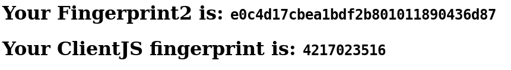
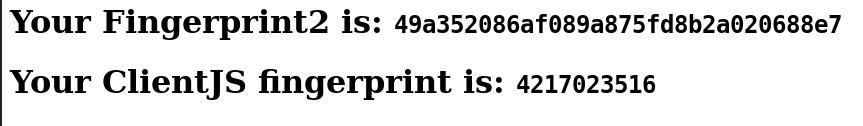
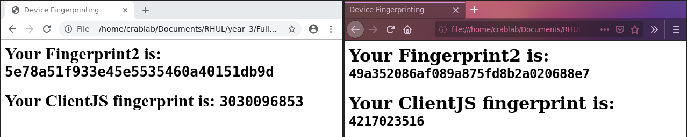

Tracking a user within a website (or indeed across the internet) has been possible either by checking the IP address of the origin or by use of cookies for state management, the mechanism of which was described in the 1997 RFC [@kristol_http_nodate]. As part of the new clicker system it is envisioned that some method of identifying the device the student is signing in on will be required, to allow detection of one device signing multiple people in. The IP address is too general - those connected to college WiFi or using the same network and mobile phone mast would have identical IP addresses, session cookies can be set to have long expiries but a user can remove them from their browser regardless. In order to track devices with some degree of certainty, it is therefore necessary to look at alternative means of identification. 

This type of tracking is not uncontroversial. From 2012 to 2014, Verizon (a US network carrier) injected unique identifiers into network traffic without their customers being aware of such 'supercookies' being attached to their data. [@brodkin_verizons_2016] [@noauthor_verizon_nodate] It transpired that not only were Verizon using these supercookies themselves, but third parties had discovered their existence and were using them to track individual devices for purposes such as advertising. The FCC's investigation determined that Verizon should have sought explicit opt-in consent from customers for the direct sharing of what the FCC referred to as UIDH (unique identifier headers) and given the option for customers to opt out of their use by Verizon internally. A specific case cited related to a third party advertiser using supercookies to continue tracking customers after they had explicitly removed normal cookies from their devices. In the UK, the European Union General Data Protection Regulations apply. The law contains specific provision for what it calls "Special category Data". This is "personal data which the GDPR says is more sensitive, and so needs more protection." [@gov.uk_guide_nodate] and includes "biometric" data which traditionally has been used to refer to specific human characteristics (such as retina data) however could arguably be applied to specific characteristics of a device a user owns; in the same way that an IP address is considered Personally Identifiable Information.[@noauthor_eur-lex_nodate] The Electronic Frontier Foundation run an online service, @noauthor_panopticlick_nodate, which will attempt to fingerprint your browser in a sandbox, displaying the results. Their test, however, is somewhat dated as @boda_user_2012 observes - relying on Flash or Java plugins to properly fingerprint the available fonts. They also note the potential for plugin detection - where the available plugins to the browser are queried and used as identifiers - given how unique the combination can be. 

Browser fingerprinting takes various characteristics within a browser via the JavaScript API (and formally via Flash and Java virtual machines too) and uses these to essentially narrow down a browser to a very small intersection of sets. Taking a simplistic example, a browser with resolution of 1080x760px might have 100 possible other configurations, if we then also include the CPU class that might narrow down the intersection to 50 devices. Then taking the system language it might be possible to reduce the intersection to 40 devices, and so on. On their own, these identifiers are not unique - it is only when they are combined that you reduce the probability of finding another device with an identical configuration. There are some examples [@mozilla_browser_nodate] of identifiers that might be used:  

- `browserSettings.openUrlbarResultsInNewTabs`: whether URL bar autocomplete search results open in a new tab or not 
- `browserSettings.homepageOverride`: the current value of the home button URL 
- `runtime.PlatformOs`: the platform Operating System 
- `runtime.PlatformArch` the platform architecture 

These seem fairly obvious but there are more advanced techniques such as HTML5 web canvas and WebGL fingerprinting. WebGL is a graphics API that allows the programmatic drawing and rendering of images on a canvas.[@kobusinska_device_2017] The technique used is to draw an image onto the canvas and then convert the result back into text which can be compared against other results to determine uniqueness. In this particular study the large changes seen in a controlled environment and relatively large execution time led that WebGL fingerprinting contained too much entropy to be useful as an additional identifier to measure. The @kobusinska_device_2017 method was not described in detail however a novel approach was presented by @MS12 which utilized both HTML5 and WebGL. Key to their approach was the rendering of text which they matched against known samples (using automated methods that are not relevant here) - this was done with both WebFont (HTML5) and standard font face rendering. The WebGL test used a black and white image containing 200 polygons - derived from the ISO 12233 standard - and the various rendered images were then subtracted from a control to give a "diff" between the generated outputs for each browser, which could then be compared. The paper contains some illustrations to demonstrate the point. 

The actual result from a browser fingerprint is a hash of all of the attributes selected to identify the browser. This hash can then be stored, to be checked against future computations of the hash. As @ashouri_large-scale_nodate notes into research reverse engineering fingerprinting solutions, these hashes are increasingly calculated server side with the raw values extracted sent to the server. Not only is this not ideal as there is a significant transfer of quite sensitive data, but the calculations are carried out in a black box that cannot be analysed. Another variant mentioned by @ashouri_large-scale_nodate is commercially available scripts that are loaded from a third party, returning the result directly to them for analysis and  storage. An example here is provided by Adyen[@noauthor_device_nodate] who provide customers with a script used to calculated a browser fingerprint, for the purposes of their own internal fraud prevention and 3DSecure Version 2. 

\pagebreak 

# Proof of Concept 

There are two commonly used and freely available libraries for calculating browser fingerprints - Fingerprint2 [@v_valve/fingerprintjs2_2019] and [@noauthor_clientjs_nodate], the latter of which implements some of Fingerprint2. 

In order to test both libraries I designed a simple HTML webpage with some basic HTML elements to visualize the fingerprint outputs. I subsequently wrote according to the respective manuals some basic fingerprinting for both Fingerprint2 and ClientJS. 


It is important to note the timeout is set to allow a certain amount of time for the page to load, as partially loaded pages generate inconsistent fingerprints. 

In Figure 1 you can see a demonstration: 



Upon a refresh in Figure 2 you will note that the ClientJS fingerprint remains static, whilst the Fingerprint2 example does not. The exact reasons for this will be down to the specific parameters each chooses to use in fingerprinting. There are many options - it would take a long time to fine tune these algorithms! 



I also compared the outputs in an incognito window and  in Figure 3 again the Fingerprint2 results do not match, whilst the ClientJS fingerprint has correctly identified the browser - despite it being in incognito mode and therefore with no cookies and no tracking. 


Finally in Figure 4, I compared the results across two browsers - Chrome and Firefox. Both Fingerprint2 and ClientJS identify them as different browsers, which is to be expected! 




# Acknowledgements 

Thanks to @marco_torchiano_how_2015 for the Pandoc table preamble and @cohen_third_2013 for the Final Year Project guide and suggested layouts. 

\pagebreak 
\onecolumn 

# Bibiography 

<div id="refs"></div>

# Appendix 

\pagebreak  

## Appendix 1

```html
<html>

<head>
    <title>Device Fingerprinting</title>
    <script type="text/javascript" src="fingerprint2.js"></script>
    <script src="client.min.js"></script>
</head>

<body>
    <h1>Your Fingerprint2 is: <code id="fp1"></code></h1>
    <h1>Your ClientJS fingerprint is: <code id="fp2"></code></h1>
</body>

</html>
```

## Appendix 2

```javascript
setTimeout(function() {
    // Fingerprint 2
    var options = {
        excludes: {
            userAgent: true,
            language: true
        }
    }
    // Based off https://github.com/Valve/fingerprintjs2#usage
    Fingerprint2.get(options, function(components) {
        var values = components.map(function(component) {
            return component.value
        })
        var murmur = Fingerprint2.x64hash128(values.join(''), 31)

        document.getElementById("fp1").innerHTML = murmur;
    })

    // ClientJS
    var client = new ClientJS();

    var fingerprint = client.getFingerprint();

    document.getElementById("fp2").innerHTML = fingerprint;

}, 500)
```
