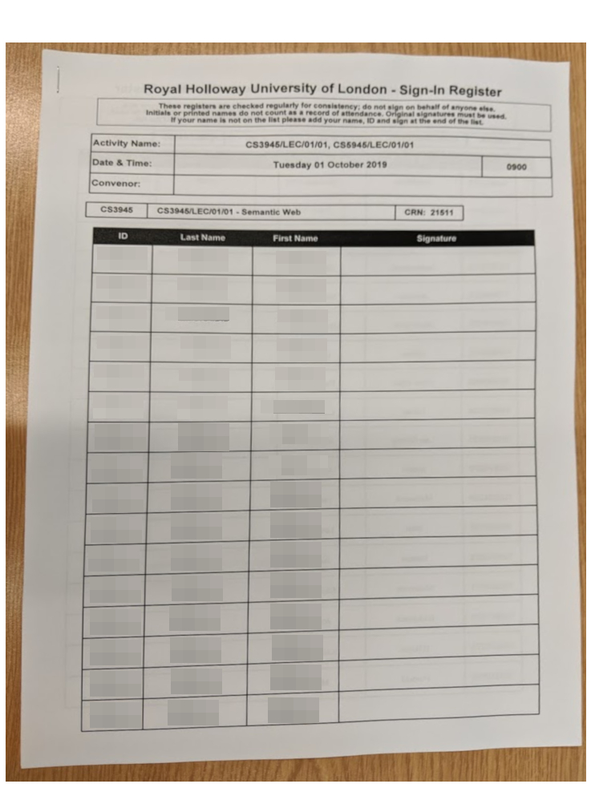

# Abstract

Royal Holloway keeps track of attendance in lectures both to ensure that students are regularly attending and also to satisfy legal requirements regarding the visas of overseas students [@home_office_uk_government_tier4_2019]. It is essential that this data is gathered and analysed efficiently and accurately.

In the past attendance has been tracked using signatures on registers. More recently, due to the lack of scalability of this former approach, a system of clickers has been employed [@royal_holloway_department_of_computer_science_department_2018]. This latter system has proved to be non-optimal and insecure. 

The aim of this research is to investigate existing attendance monitoring solutions and existing academic research into the problem to determine a more optimal solution for Royal Holloway. An MVP (Minimum Viable Product) will be built to test assumptions and demonstrate the core ideas of the proposed solution. The system will need to be user friendly and satisfy Royal Holloway's requirements whilst also not becoming burdensome on lecturers, students and administrative staff. 

## Motivation 

The primary motivation is to offer a more secure and convenient system for students. The author is well acquainted with both the paper based and clicker systems in use, and the associated merits and pitfalls. An improvement in the process not only allows less detractions from the lecture content but, as @universities_uk_student_2019 writes: "Attendance monitoring can also be perceived as unfair and harm international student experience." - a more low key and low effort system reduces the potential for discrimination as a result of the perception of international students imposing rules on domestic students, as a result of their presence. 

@universities_uk_student_2019 continues, "The current system imposes a significant administrative burden on both institutions and the Home Office..." with a survey conducted by Universities UK concluding the the total cost of compliance with Tier 4 rules being £40 million to the UK Higher Education sector [@universities_uk_student_2019]. A separate study by @ey_challenges_2019 for the Russell Group noted "Attendance monitoring is particularly time consuming across such a large university with many different modes of study. Collating the data, analysing it and escalating cases for investigation/explanation has created an industry of work for very little tangible benefit given that HEI students are very low risk of visa abuse.". 

It is therefore clear that a more streamlined, automated and secure system is a clear benefit to both the University and Higher Education sector alike, as well as to students. 

# Introduction

The signed registers, as in Figure 1, consist of a dossier of pages circulated throughout the class during a lecture. These pages are printed in advance by the departmental office based on the course registration list and subsequent timetables. The four columns are reserved for the printed student ID number, printed student name and their signature which is added during the lecture as proof of their attendance. The registers are collected by the lecturer at the end of a session, certified and returned to the office where they are analysed. 



Several complications have arisen with this system. Some lectures are big enough that at least two registers are required for them to circulate throughout the session and avoid a rush to sign at the end of a lecture - this of course creates added complication as to where the register needs to be passed next. It then also requires at least double the effort in correlating and combining the signatures by the administrative staff and there is no guarantee that both sections will remain together in transit!

Of course, there are rather more obvious issues such as the environmental impact of reams of paper each day and forging of signatures; the latter is explicitly mentioned in the departmental handbook "You must not sign the attendance register for anyone else, or allow someone else to sign the register on your behalf...These behaviours are fraudulent and will result in disciplinary action being taken." [@royal_holloway_department_of_computer_science_department_2018]. 

For the 2018 intake of first year undergraduates it was decided that due to the class size, paper registers were infeasible. The clicker systems was proposed and developed. This uses a Turning Technologies "Response Card" (Figure 2) typically used to respond to interactive questionnaires as part of a slideshow. The device communicates with a base station connected to a computer via USB (Universal Serial Bus) when a key option is pressed (eg. "1/A") and transmits the unique ID of the device and the key press. The message is acknowledged by the base station and the user is given visual affirmation on the device that their response was counted. The results are then stored in a semi-proprietary format attached to the slideshow which is decoded, processed and analysed by the department using a collection of scripts, Excel spreadsheets and custom software. 


The entirely custom decoding and data processing is due to the device being used outside its intended purpose. Turing Technologies [-@noauthor_lcd_nodate] advertise its use purely as a device for polling students as they interact with a slideshow during a class. The device level data appears to have been intended to prevent duplication and to allow scoring across multiple questions. Several problems have been reported with processing the data saved by the slideshow; the most interesting of which relates to the unique identifies for each device which are a hexadecimal string. For certain combinations (eg. "100000"), the spreadsheet program used for data processing parses this as an integer and will "helpfully" rectify it to the exponential form, $$ 1E^6 $$ 
This then requires manual correction for each row affected. 

However, this research stems from a much larger flaw the author discovered when reading a blog [@goodspeed_travis_2010] on a similar device by Turning Technologies. The blogger writes "It can be seen from the code that the 0x1A IRAM byte holds the channel number. That is, if 0x20 is stored at 0x1A, the radio will be configured to 2,432 MHz. The other configuration bytes reveal that the MAC addresses are 24 bits, the checksum is 16 bits, and the device broadcasts at maximum power sourced from a 16MHz crystal". Whilst this analysis might seem innocuous the crucial discovery made in that blog post is the entire register is sent directly to the radio chip - there is no encryption. As stated later on "...packets could be broadcast by a reprogrammed Clicker or NHBadge to make a student in virtual attendance..." which is a very dangerous for a device intended to be used in Computer Science classes! 

@goodspeed_travis_2010 concentrates on the earlier and less advanced "Response Card" which does not have an LCD screen, as opposed to the device in Figure 1. Their work was referenced and expanded in another blog by @killian_turning_2012 for which the code (now no longer directly available) was modified and re-worked by @mooney_nickmooney/turning-clicker_2019. This software emulates the base station connected to the computer and outputs the results:

``` {.numberLines startFrom="89"}
Serial.print(F("incoming: "));
for (int i = 0; i < BUFSIZE; i++) {
    printf("%02x", incomingData[i]);
}
printf(" --> %c", incomingData[ADDR_WIDTH]);
Serial.println();
```

In order to produce a working proof of concept attack on the attendance system I will first verify that @mooney_nickmooney/turning-clicker_2019 works with my personal clicker before developing software on another Arduino to work with the emulated base station to spoof multiple clickers on demand. I will then test my attack on an actual base station to prove the results of the sign in slideshow can still be processed by the department. 

<!-- 

I will then turn to developing a functional solution to the problem, solving the aforementioned issues. In doing so, it is helpful to look at the origins of attendance monitoring and prior inventions. @jones_attendance_2003 applied for a patent relating to an attendance monitoring system for employers. They write "While the invention is particularly directed to the art of attendance monitoring in a paid labor environment, and will be thus described with specific reference thereto, it will be appreciated that the invention may have usefulness in other fields and applications". This is particularly important to note as attendance monitoring and timekeeping solutions have existed in industry for some time, indeed the first recognized patent for a mechanical device using punch cards to track employee hours was made in 1901 [@bundy_workmans_1901]. When further considering @jones_attendance_2003 they describe a system containing "...instant Visual representation of an employee's daily attendance (including that for the present day), attendance history..." which coupled with ""

-->

# Theory 

# Software Engineering

# Self-Evaluation

# Professional Issues 

A key part of my solution uses what is known as browser fingerprinting. At a high level, this takes various attributes available from your web browser and underlying operating system that may not be immediately obvious or visible, and uses these to gradually whittle down your particular configuration into a smaller and smaller subset of individual systems. Some examples of attributes used include:

# Acknowledgements 

Thanks to @tom_pollard_template_2016 for the front cover template which I have adapted and "corentin" for the Gantt chart example in \LaTeX [@noauthor_pgfgantt_nodate].

\pagebreak 
\onecolumn 

# Bibiography 

Due to the nature of this project, available references on the subject are limited and will be confined to more general information security concepts as well as attendance monitoring. In this report the available references are provided by those who have investigated these devices beforehand. 

---

<div id="refs"></div>